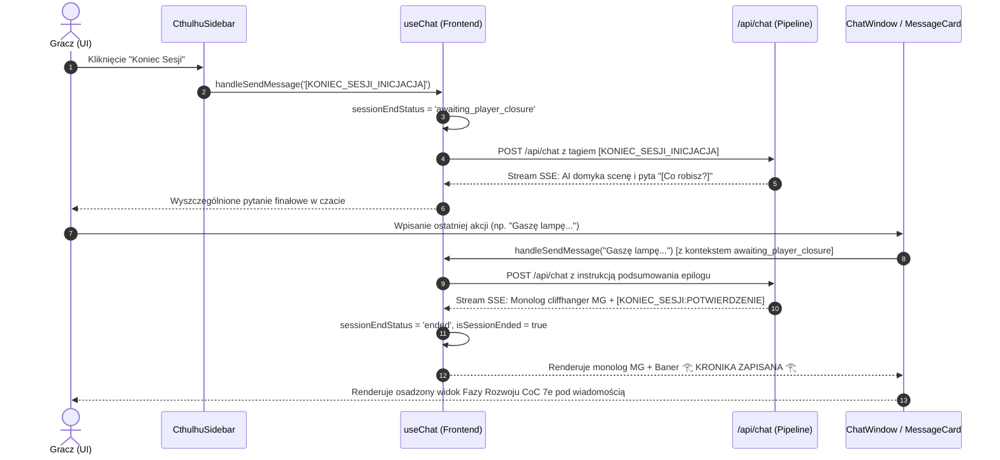

# Research: Dwuetapowy Przepływ "Koniec Sesji" & Faza Rozwoju CoC 7e (LOG-01)
Data: 2026-07-23  
Stack: Next.js (App Router), React, TypeScript, TailwindCSS, Gemini AI Studio API, Jest, Playwright  

---

## 🎯 Obszar problemu

Obecnie kliknięcie przycisku **"Koniec Sesji"** w `CthulhuSidebar` wysyła natychmiastowy sygnał `[KONIEC_SESJI]`, na który backend reaguje nakazem nagłego ucięcia fabuły z markerem `[KONIEC_SESJI:POTWIERDZENIE]`. Uniemożliwia to graczowi wykonanie finałowej akcji lub gestu badacza, a Faza Rozwoju CoC 7e (rzuty na rozwój umiejętności, odzysk Szczęścia, Samopomoc/SAN) jest wywoływana wyłącznie ręcznie z osobnego przycisku w sidebarze.

### Wymagany przepływ (LOG-01):
1. **Krok 1 (Kliknięcie "Koniec Sesji"):** Sygnał `[KONIEC_SESJI_INICJACJA]` (lub `[KONIEC_SESJI]`) ➔ AI przygotowuje domknięcie sceny z pytaniem `[Co robisz?]` (bez `[KONIEC_SESJI:POTWIERDZENIE]`).
2. **Krok 2 (Finałowa Akcja Gracza):** Gracz opisuje ostatni gest badacza (np. "Zamykam księgę i spoglądam w deszczowe okno...").
3. **Krok 3 (Epilog & Cliffhanger MG):** AI generuje monolog podsumowujący/cliffhanger z lektorem i umieszcza tag `[KONIEC_SESJI:POTWIERDZENIE]` na samym końcu.
4. **Krok 4 (Faza Rozwoju CoC 7e Inline):** Pod wiadomością w czacie automatycznie wyświetla się interaktywny boks Fazy Rozwoju badacza (rzuty +1K10% dla oznaczonych `[✓]`, bonus SAN +2K6 za mistrzostwo 90%+, odzysk Szczęścia 1K10, Samopomoc) oraz podziękowanie i potwierdzenie zapisu.

---

## 📁 Zaangażowane pliki i ich rola

| Plik | Ścieżka | Rola w LOG-01 |
| :--- | :--- | :--- |
| **`run-chat-pipeline.ts`** | `src/app/api/chat/_helpers/run-chat-pipeline.ts` | Obsługa wstrzykiwania instrukcji systemowych dla `[KONIEC_SESJI_INICJACJA]` vs `[KONIEC_SESJI_FINAL]`. |
| **`default-gm-prompt.md`** | `public/default-gm-prompt.md` | Protokół Koniec Sesji w prompcie systemowym Strażnika Tajemnic. |
| **`useChat.ts`** | `src/hooks/useChat.ts` | Zarządzanie stanem etapu finału `sessionEndStatus` (`'idle' \| 'awaiting_player_closure' \| 'ended'`), wykrywanie tagów SSE. |
| **`page.tsx`** | `src/app/page.tsx` | Przekazywanie `sessionEndStatus` i `isSessionEnded` z `useChat` do `CthulhuSidebar` oraz `ChatWindow`. |
| **`CthulhuSidebar.tsx`** | `src/components/sidebar/CthulhuSidebar.tsx` | Przycisk Koniec Sesji reagujący na 3 etapy (Normalny / Oczekiwanie na słowo gracza / Zablokowany). |
| **`MessageInput.tsx`** | `src/components/chat/chat-window/components/message-input.tsx` | Zmiana placeholdera i stan zablokowania po pełnym zakończeniu. |
| **`MessageCard.tsx`** | `src/components/chat/chat-window/components/message-card.tsx` | Renderowanie banera Kroniki oraz osadzonej sekcji Fazy Rozwoju CoC 7e pod finałową wiadomością MG. |
| **`DevelopmentPhaseModal.tsx`** / **`DevelopmentPhaseCard.tsx`** | `src/components/dialogs/` & `src/components/chat/` | Wyodrębnienie współdzielonej logiki Fazy Rozwoju (`useDevelopmentPhase` lub inline `DevelopmentPhaseCard`). |
| **`useSkillMarking.ts`** | `src/hooks/useSkillMarking.ts` | Dostarczanie listy oznaczonych umiejętności i czyszczenie flaga `markedForImprovement` po rozwoju. |

---

## 🔄 Przepływ danych i zależności (Data Flow & Interfaces)

---

## 🧪 Istniejące testy i ocena pokrycia

1. **Testy jednostkowe Jest:**
   - `useChat.duet.test.ts` (weryfikuje wyłącznie logikę trybu Duet, brak testów dla `isSessionEnded` i `sessionEndStatus`).
   - `mechanics-parser.test.ts` (testuje tagi testów umiejętności, brak testów dla `cleanupContent('[KONIEC_SESJI:POTWIERDZENIE]')`).
   - `chat-header.test.tsx`, `equipment-detail-dialog.test.tsx`, `equipment-modal.test.tsx` (7/7 PASSED).

2. **Testy Playwright E2E:**
   - `tests/e2e/feature-3-chat-ui.spec.ts` i `full-playtest.spec.ts` (sprawdzają kliknięcie przycisku w sidebarze).

3. **Luki w testach do uzupełnienia w planie:**
   - Dedykowany test w `cleanup.test.ts` dla wycinania tagu potwierdzenia.
   - Test jednostkowy dla `useChat` z przejściem stanów `idle` ➔ `awaiting_player_closure` ➔ `ended`.
   - Test komponentu `DevelopmentPhaseCard` pod finałową wiadomością.

---

## ⚠️ Ryzyka i uwagi architektoniczne

1. **Przekazywanie stanu `isSessionEnded`:**
   - Mimo istnienia propa `isSessionEnded` w `CthulhuSidebar` i `ChatWindow`, w `src/app/page.tsx` prop ten **nie był przekazywany**. Trzeba to powiązać przy wdrożeniu.
2. **Brak oznaczonych umiejętności przy końcu sesji:**
   - Jeśli gracz nie oznaczył żadnej umiejętności w trakcie sesji (`markedCount === 0`), Faza Rozwoju powinna bezbłędnie wyświetlić informację edukacyjną i umożliwić odzysk Szczęścia / Samopomoc bez zgłaszania błędów.
3. **Audio / TTS Lektora:**
   - Monolog epilogu w Kroku 3 musi płynnie odczytać lektor, a ukryty tag `[KONIEC_SESJI:POTWIERDZENIE]` nie może trafiać do kolejki audio ElevenLabs/Gemini TTS.

---

## 📋 Rekomendowany następny krok

Przejście do skilla `/dev-2-plan` i utworzenie szczegółowego planu implementacji dwuetapowego końca sesji z integracją Fazy Rozwoju CoC 7e.
