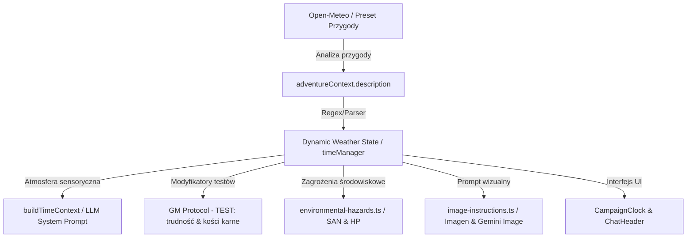

# Research: System Pogody i Otoczenia w Strażnik Tajemnic AI
Data: 2026-07-22  
Stack: Next.js 14 (App Router), React 18, TypeScript (strict), Google Gemini API, Jest, Playwright  

---

## 1. Obszar i mapa problemu

Z przeprowadzonej analizy kodu silnika wynika, że pogoda jest obecnie obecna w systemie w sposób częściowy / rozproszony:
1. **Analizator scenariusza (`src/app/api/adventure/analyze/route.ts`):** Pobiera z Open-Meteo historyczną pogodę na podstawie geolokalizacji i roku przygody i dopisuje sekcję `[KLIMAT & POGODA]` do opisu przygody.
2. **Mechanika CoC 7e (`src/lib/environmental-hazards.ts`):** Zawiera twarde zasady i tabele CoC 7e dla zagrożeń środowiskowych (`cold-mild`, `cold-extreme`, `heat-exhaustion`, `drowning-rough`).
3. **Kontekst atmosferyczny (`src/lib/time-atmosphere.ts` i `build-time-context.ts`):** Buduje sensoryczny kontekst czasowy (pora dnia, faza księżyca) i przekazuje go do promptu Mistrza Gry.
4. **Pasek statusu (`CampaignClock` & `ChatHeader`):** Komponent `CampaignClock` obsługuje czas, porę dnia i fazę księżyca, ale nie posiada widocznego wskaźnika pogodowego.

---

## 2. Przepływ danych i zależności

### Kluczowe powiązania mechaniczne:
- **Mistrz Gry (LLM):** Otrzymuje dyrektywę pogodową w `buildTimeContext`, co wymusza sensoryczny opis mgły, ulewy czy mrozu.
- **Rzuty k100 (`dice-utils.ts` & `skill-test-resolver.ts`):** Pogoda może wpływać na podwyższenie progu trudności (`hard`/`extreme`) lub nakładać kość karną (`bonusDice: -1`) przy trudnych warunkach (np. strzelanie we mgle, nasłuchiwanie w zawierusze).
- **Generator Ilustracji (`image-instructions.ts`):** Stan pogody jest dopisywany do promptu graficznego (np. `rain-slicked cobblestone street, heavy fog`), zachowując spójność wizualną.
- **Zagrożenia środowiskowe (`environmental-hazards.ts`):** Mróz i upał rozliczają automatyczne testy CON i utratę punktów zdrowia/poczytalności.

---

## 3. Stan testów i brakujące obszary

- **Istniejące testy:**
  - `build-immersion-context.test.ts` (testuje astronomię, fazy księżyca i tryb offline).
  - `chat-header.test.tsx` (testuje wyświetlanie lokacji i zamockowanego zegara).
- **Brakujące testy do wdrożenia:**
  - `campaign-clock.test.tsx` (rendering wskaźnika pogody, czasu i pory dnia).
  - `time-manager.test.ts` (przechowywanie i aktualizacja stanu pogody oraz czasu).
  - `analyze/route.test.ts` (parsowanie sekcji `[KLIMAT & POGODA]`).

---

## 4. Ryzyka i uwagi architektoniczne

1. **Zrywanie spójności z mechatroniką czasu:** Zmiana godziny/dnia powinna zachowywać płynność pogody (np. ulewa nie powinna zniknąć w 5 minut bez powodu narracyjnego).
2. **Nadmierne utrudnienia dla gracza:** Modyfikatory trudności i kości karne z pogody muszą być nakładane przez MG tylko w sytuacjach uzasadnionych taktycznie, aby nie zablokować rozgrywki.
3. **Formatowanie w UI:** Pasek statusu nie może ulec przeładowaniu – pogoda powinna mieć czytelną ikona z podpowiedzią (tooltip) lub kompaktowy opis.

---

## 5. Rekomendacja dalszych kroków

Przejście do fazy planowania (`/dev-2-plan`) w celu przygotowania dokładnej specyfikacji i planu implementacji:
1. Rozszerzenie `timeManager` i `CampaignClock` o oficjalny stan pogody (z ikonami i tooltipem).
2. Spięcie pogody z `buildTimeContext` oraz instrukcją generowania ilustracji.
3. Utworzenie pełnego pakietu testów jednostkowych.
