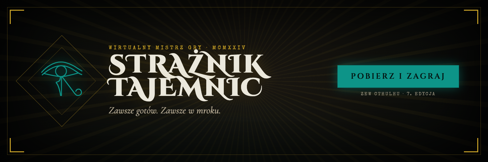
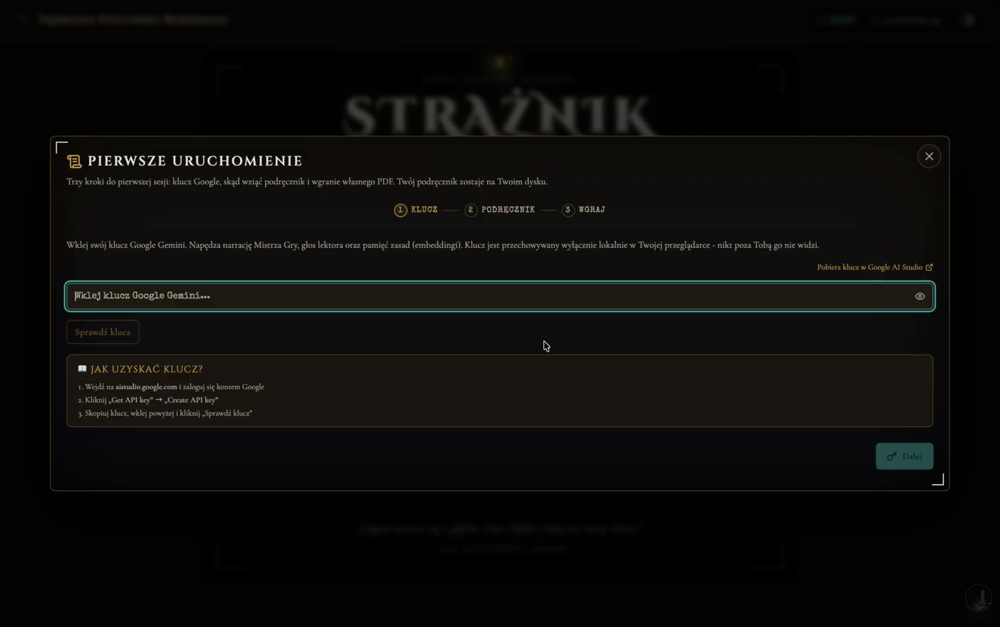
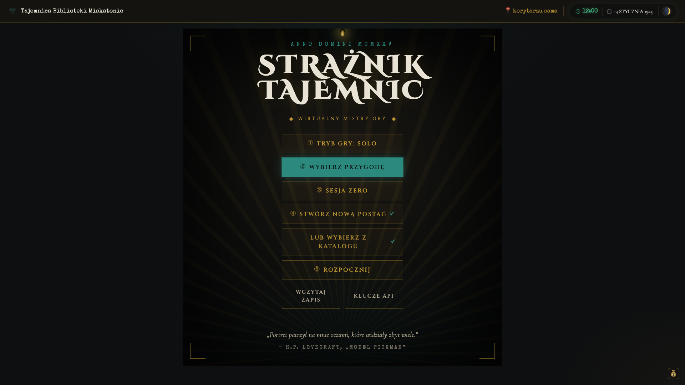
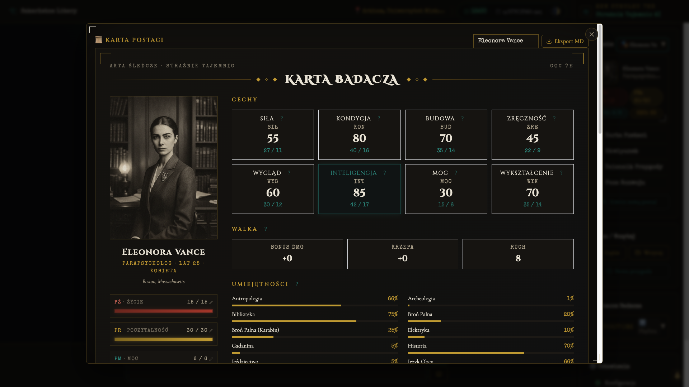
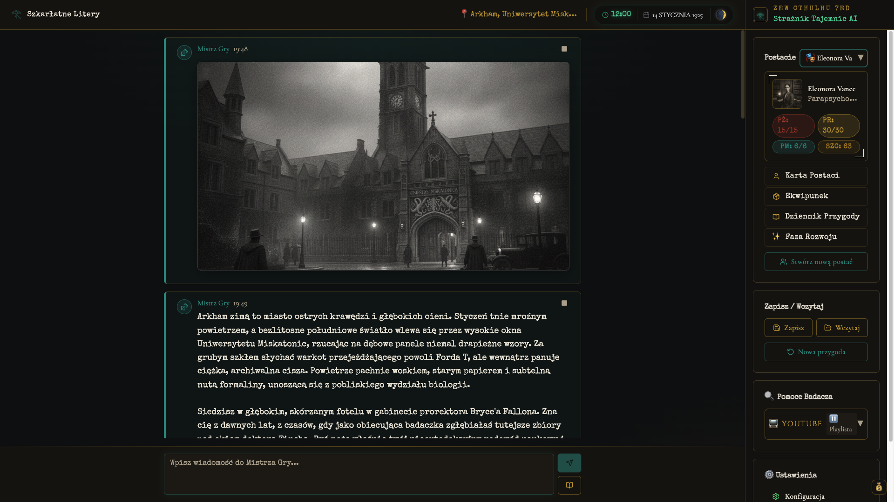
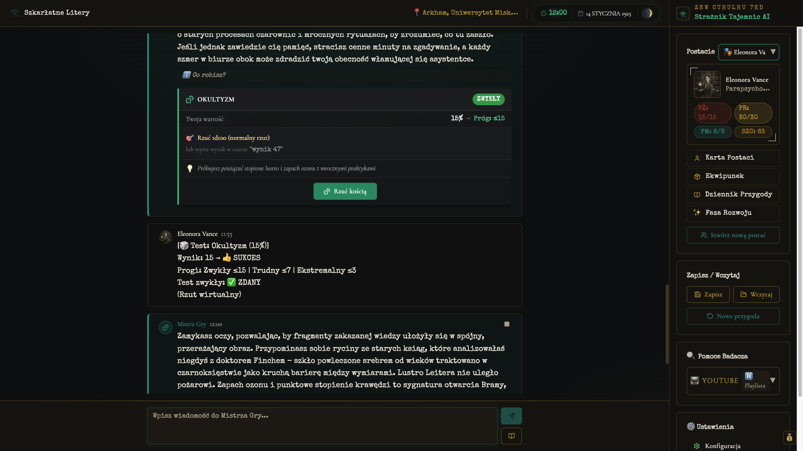

<div align="center">



# 𓂀 Strażnik Tajemnic AI

**Nieoficjalny, fanowski Mistrz Gry AI do sesji RPG w klimacie lovecraftowskim.**

Prowadź sesje _Zew Cthulhu 7e_ solo lub przy jednym laptopie (Hot Seat). Cała gra
toczy się **lokalnie u Ciebie** - wklejasz własny klucz Gemini, wgrywasz **swój**
podręcznik, save'y lądują na dysku. Bez logowania, bez chmury, bez telemetrii.

<a href="https://youtu.be/k3NioUBRIes">
  
</a>

▶️ [Obejrzyj wideo wprowadzające na YouTube](https://youtu.be/k3NioUBRIes)

</div>

---

## 👥 Dla kogo

Przychodzi taki etap życia, że zebranie ekipy na sesję RPG graniczy z cudem - kalendarze się nie spinają, ludzie się rozjeżdżają, a ochota na granie zostaje. **Strażnik Tajemnic** sprawia, że nie musisz na nikogo czekać - bierze rolę Mistrza Gry na siebie, żebyś dalej przeżywał mroczne przygody w świecie Lovecrafta na własnej kanapie.

- **Solo** - zagraj sam, kiedy tylko masz chwilę. AI prowadzi narrację i pamięta NPC, wątki oraz konsekwencje przez całą kampanię, więc historia trzyma się kupy.
- **We dwoje (Hot Seat)** - jeden laptop, wspólny wieczór z grozą: każde z Was ma własną postać i kolor, a AI zwraca się do graczy po imieniu. Bez kompletowania całej drużyny.

---

## ⬇️ Pobierz

**[Pobierz gotową paczkę (ZIP)](https://github.com/InduPhantom-hash/straznik-tajemnic/releases/latest)** - cała aplikacja w środku, uruchamiasz dwuklikiem (Windows / Mac). Bez klucza API i bez podręcznika w paczce: przy pierwszym starcie wklejasz **własny** klucz Gemini i wgrywasz **swój** PDF (apka linkuje do źródeł).

> Wolisz uruchomić ze źródeł? Instrukcja niżej (**Szybki start**).

---

> [!IMPORTANT]
> **Projekt fanowski, nieoficjalny.** Nie jest powiązany z Chaosium Inc. ani Black Monk.
> Aplikacja to **sam silnik** - nie zawiera żadnego podręcznika. Grasz na **własnym,
> legalnie nabytym** egzemplarzu (darmowy starter albo pełne wydanie - apka linkuje do
> źródeł przy pierwszym uruchomieniu). _Call of Cthulhu_ / _Zew Cthulhu_ to znaki
> towarowe Chaosium Inc. Szczegóły: [`NOTICE`](./NOTICE).

## ✨ Co potrafi

- **AI Mistrz Gry** - prowadzi narrację w stylu Lovecrafta, reaguje na decyzje graczy.
- **Kreator postaci** - badacz CoC 7e (charakterystyki, umiejętności, zawód, portret).
- **Mechaniki CoC 7e** - rzuty k100, testy umiejętności, Push Roll, poczytalność (SAN),
  Szczęście, Faza Rozwoju - liczone przez aplikację (deterministycznie), AI opisuje skutek.
- **Hot Seat** - 1-2 graczy przy jednym laptopie, każdy ma swoją postać i kolor.
- **Lektor (TTS)** - głos Mistrza Gry czyta narrację.
- **Ilustracje scen** - obrazy generowane w trakcie sesji.
- **Lokalny RAG** - apka zna zasady z **Twojego** wgranego podręcznika (anty-halucynacja).
- **Zegar kampanii, dziennik, zapis/wczytanie** na dysk.

## 📸 Zrzuty ekranu

<table>
  <tr>
    <td width="50%"><br><sub><b>Menu główne</b> - wybór trybu, przygody i postaci.</sub></td>
    <td width="50%"><br><sub><b>Test umiejętności</b> - Tacka liczy rzut k100 wg progów CoC 7e.</sub></td>
  </tr>
  <tr>
    <td width="50%"><br><sub><b>Scena z AI</b> - ilustracja i narracja Mistrza Gry w stylu Lovecrafta.</sub></td>
    <td width="50%"><br><sub><b>Karta badacza</b> - charakterystyki, umiejętności i stan postaci.</sub></td>
  </tr>
</table>

## 🚀 Szybki start

> Najprościej: [pobierz gotową paczkę ZIP](https://github.com/InduPhantom-hash/straznik-tajemnic/releases/latest) i uruchom dwuklikiem. Poniżej instrukcja dla uruchomienia ze źródeł (deweloperskiego).

> Wymagania: **Node.js 18+** i darmowy **klucz Gemini** (`https://aistudio.google.com/apikey`).

```bash
npm install
npm run dev
```

Otwórz [http://localhost:3000](http://localhost:3000). Przy pierwszym uruchomieniu
kreator przeprowadzi Cię przez setup:

1. **Wklej klucz Gemini** (test jednym kliknięciem).
2. **Skąd wziąć podręcznik** - linki do darmowych starterów i pełnych wydań.
3. **Wgraj swój PDF** - apka zindeksuje zasady lokalnie i jesteś gotowy do gry.

Pełna instrukcja krok po kroku: [`SETUP.md`](./SETUP.md).
Jak grać: [`docs/USER_GUIDE.md`](./docs/USER_GUIDE.md).

### macOS - launcher na biurku (opcjonalnie)

```bash
bash desktop/build-app.sh --rebuild
```

Tworzy `Strażnik Tajemnic AI.app` (ikona Oka Horusa) w `~/Applications`
i alias na biurku. Dwuklik = serwer startuje, otwiera się okno gry, zamknięcie
okna ubija serwer. Windows/Linux: korzystaj z `npm run dev` / `npm run build && npm start`.

## ⚙️ Konfiguracja

Skopiuj `.env.example` do `.env.local`. Jedyny **wymagany** klucz to `GEMINI_API_KEY`
(czat + RAG + lektor + obrazy - wszystko z rodziny Gemini API). Reszta jest opcjonalna
(alternatywne generatory obrazów / lektora). Szczegóły z komentarzami w
[`.env.example`](./.env.example).

## 🏚️ Presety jakości

Sesja ≈ 3h gry. Preset ustawiasz w Ustawieniach; domyślnie **HIGH**.

| Preset      | Model czatu      | Lektor         | Obrazy          |
| ----------- | ---------------- | -------------- | --------------- |
| **LOW**     | Gemini Flash     | brak           | Gemini          |
| **MID**     | Gemini Flash     | Google TTS     | Gemini          |
| **HIGH** ⭐ | Gemini 2.5 Flash | Gemini TTS     | Gemini / Vertex |
| **ULTRA**   | Gemini Pro       | Gemini Pro TTS | Gemini / Vertex |

> Koszt sesji zależy od presetu i Twojego cennika Gemini - apka pokazuje licznik na żywo.

## 🔧 Technologie

Next.js 14 (App Router) · React 18 + TypeScript (strict) · Tailwind + shadcn/ui ·
Google Gemini API (czat / embeddingi / TTS / obrazy) · lokalny RAG (Float32 binarny,
cosine) · Jest + Playwright.

## 📚 Dokumentacja

| Dokument                                         | Dla kogo                                         |
| ------------------------------------------------ | ------------------------------------------------ |
| [`SETUP.md`](./SETUP.md)                         | Instalacja i pierwsze uruchomienie krok po kroku |
| [`docs/USER_GUIDE.md`](./docs/USER_GUIDE.md)     | Gracz - jak prowadzić sesję                      |
| [`docs/ARCHITECTURE.md`](./docs/ARCHITECTURE.md) | Deweloper - jak to działa pod spodem             |
| [`docs/TESTING.md`](./docs/TESTING.md)           | Deweloper - testy                                |
| [`CONTRIBUTING.md`](./CONTRIBUTING.md)           | Jak współtworzyć                                 |
| [`NOTICE`](./NOTICE)                             | Status prawny, znaki towarowe, treść             |

## 📄 Licencja

Kod: **MIT** (patrz [`LICENSE`](./LICENSE)). Licencja obejmuje wyłącznie silnik -
nie nadaje żadnych praw do treści gier ani podręczników. Twórczość H.P. Lovecrafta
jest w domenie publicznej.

---

<div align="center"><sub>Created by Phantom · projekt fanowski, non-profit</sub></div>
