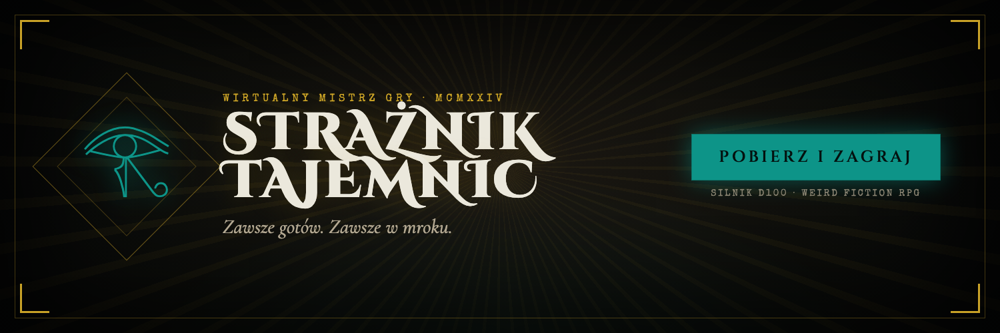
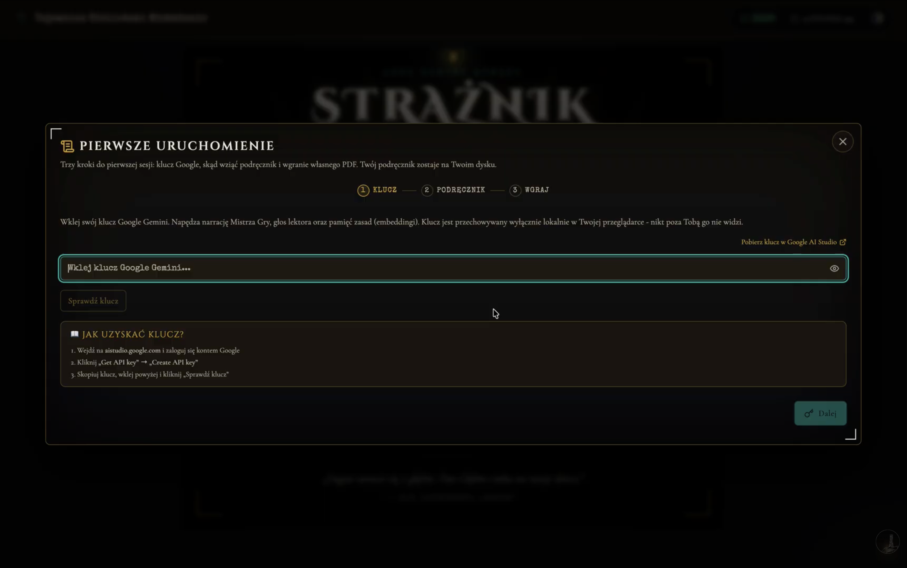
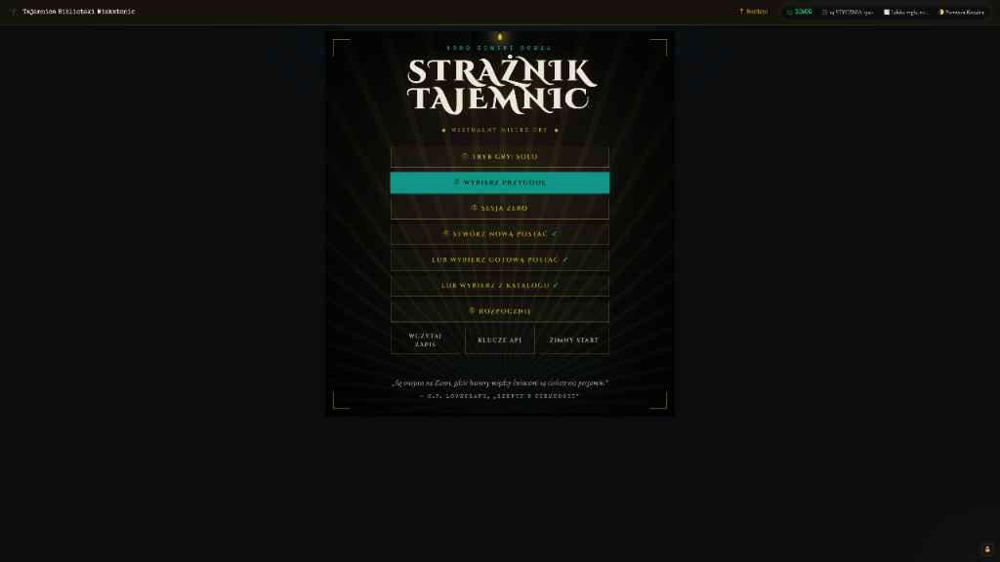
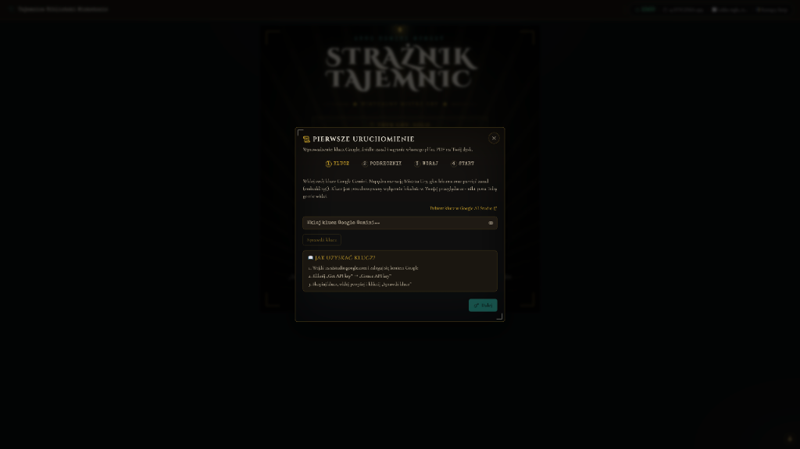
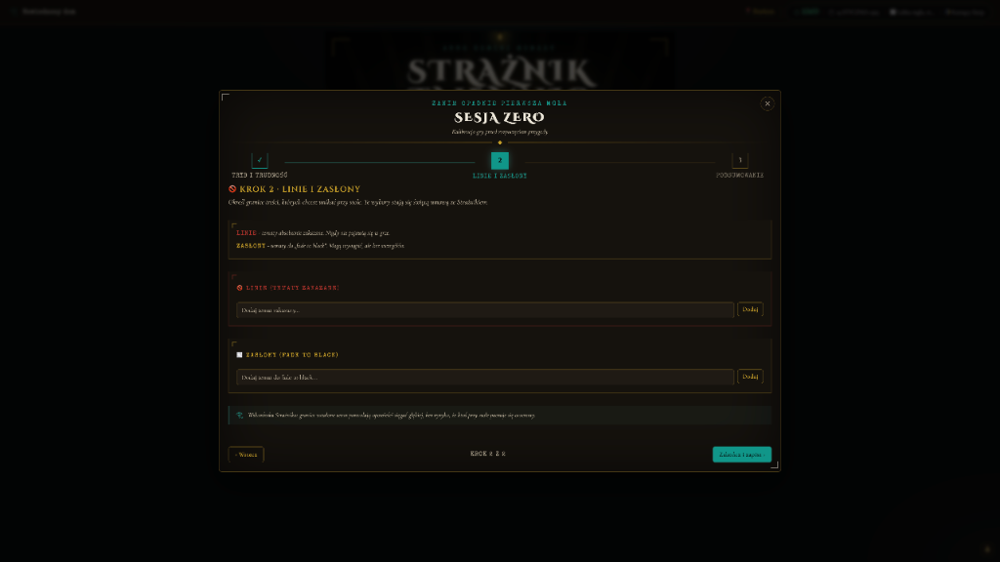
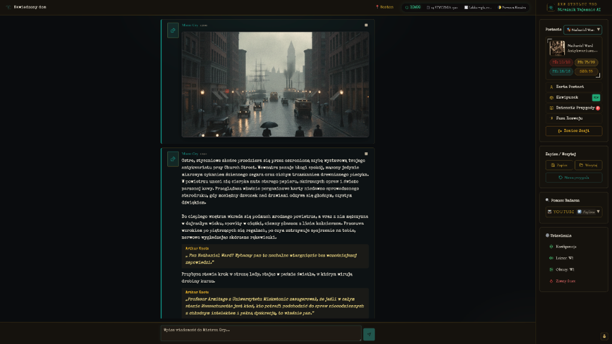
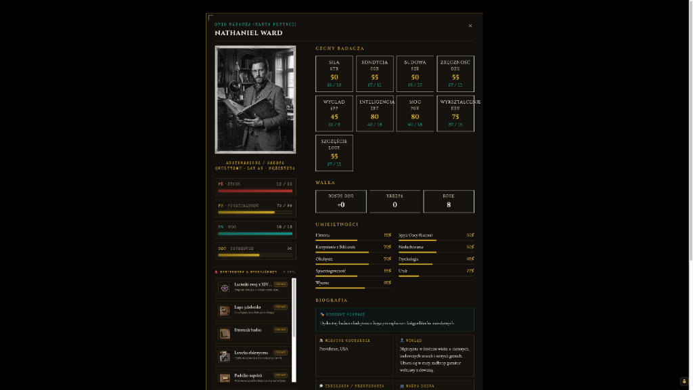
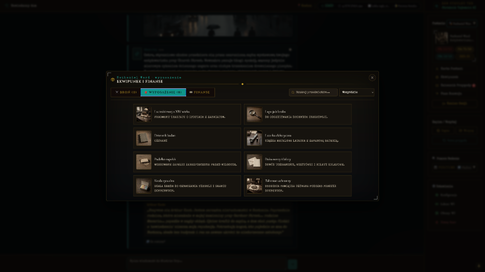

<div align="center">



# 𓂀 Strażnik Tajemnic AI / Keeper of Arcane Lore AI (v0.9.3)

**Nieoficjalny, fanowski Mistrz Gry AI do sesji RPG w klimacie lovecraftowskim.**  
*An unofficial, fan-made AI Game Master for RPG sessions in the Lovecraftian setting.*

---

[🇵🇱 Wersja Polska](#-straznik-tajemnic-ai-v093) | [🇺🇸 English Version](#-keeper-of-arcane-lore-ai-v093)

</div>

---

# 🇵🇱 Strażnik Tajemnic AI (v0.9.3)

Prowadź sesje _Zew Cthulhu 7e_ solo lub przy jednym laptopie (Hot Seat). Cała gra toczy się **lokalnie u Ciebie** - wklejasz własny klucz Gemini, wgrywasz **swój** podręcznik, save'y lądują na dysku. Bez logowania, bez chmury, bez telemetrii.

<a href="https://youtu.be/k3NioUBRIes">
  
</a>

▶️ [Obejrzyj wideo wprowadzające na YouTube](https://youtu.be/k3NioUBRIes)

## 👥 Dla kogo

Przychodzi taki etap życia, że zebranie ekipy na sesję RPG graniczy z cudem - kalendarze się nie spinają, ludzie się rozjeżdżają, a ochota na granie zostaje. **Strażnik Tajemnic** sprawia, że nie musisz na nikogo czekać - bierze rolę Mistrza Gry na siebie, żebyś dalej przeżywał mroczne przygody w świecie Lovecrafta na własnej kanapie.

- **Solo** - zagraj sam, kiedy tylko masz chwilę. AI prowadzi narrację i pamięta NPC, wątki oraz konsekwencje przez całą kampanię, więc historia trzyma się kupy.
- **We dwoje (Hot Seat)** - jeden laptop, wspólny wieczór z grozą: każde z Was ma własną postać i kolor, a AI zwraca się do graczy po imieniu. Bez kompletowania całej drużyny.

## ⬇️ Download / Pobierz

**[Pobierz gotową paczkę (ZIP)](https://github.com/InduPhantom-hash/straznik-tajemnic/releases/latest)** - cała aplikacja w środku, uruchamiasz dwuklikiem (Windows / Mac). Bez klucza API i bez podręcznika w paczce: przy pierwszym starcie wklejasz **własny** klucz Gemini i wgrywasz **swój** PDF (apka linkuje do źródeł).

> Wolisz uruchomić ze źródeł? Instrukcja niżej (**Szybki start**).

> [!IMPORTANT]
> **Projekt fanowski, nieoficjalny.** Nie jest powiązany z Chaosium Inc. ani Black Monk.
> Aplikacja to **sam silnik** - nie zawiera żadnego podręcznika. Grasz na **własnym, legalnie nabytym** egzemplarzu. _Call of Cthulhu_ / _Zew Cthulhu_ to znaki towarowe Chaosium Inc. Szczegóły: [`NOTICE`](./NOTICE).

## ✨ Co potrafi & Architektura Anty-Halucynacyjna

- **Gwarancja Zasad & Deterministyczna Mechanika (Bez Halucynacji AI):**
  - **Lokalny RAG Podręcznika:** Aplikacja automatycznie przeszukuje **Twojego** wgranego PDF-a i podaje dokładny kontekst reguł do zapytania LLM. AI nie wymyśla zasad ani statystyk z głowy.
  - **Kodowane Rzuty k100:** AI **nie rzuca kośćmi w czacie**. Rzuty na umiejętności, kalkulacje progów (Zwykły, Trudny, Ekstremalny, Krytyczny, Pech), testy Poczytalności (SAN) i Poczytalności Chwilowej oraz Faza Rozwoju są wyliczane w 100% kodem aplikacji. AI otrzymuje twardy wynik i opisuje wyłącznie jego fabularne konsekwencje.
  - **Kontrola Stanu Świata:** Filtry kontynuacji narracyjnej pilnują faktów z przygody, lokacji, zdrowia badaczy oraz statusu NPC.
- **Tablica Badacza & Dziennik Śledztwa (CoC 7e RAW):** Korkowa tablica dowodów ze sznurkami powiązań, ochrona koordynatów kart po zapisie i wczytaniu, rzuty na Pomysł (Idea Roll), obsługa fałszywych poszlak, diegetyczne notatki oraz widok Akt Sprawy.
- **Ekwipunek i Ekonomia Badacza:** Pełny katalog przedmiotów fabularnych, lokalne miniatury SVG, automatyczne podnoszenie przedmiotów z narracji oraz integracja ze statystyką Majętności (Credit Rating).
- **Dynamiczne Tempo Narracji (Dynamic Pacing):** Silnik automatycznie reguluje gęstość i dynamikę opisów w zależności od poziomu poczytalności, fazy śledztwa i zagrożenia.
- **Tryb Szybka Przygoda:** Błyskawiczny start sesji z wyborem scenariusza i badacza w jednym, spójnym kroku.
- **30 Gotowych Postaci & Scenariusze Strefy 11:** Pełne biografie i powiązania dla 30 badaczy, w tym 16 dedykowanych postaci dla 4 autorskich polskich scenariuszy.
- **AI Mistrz Gry** - prowadzi narrację w stylu Lovecrafta z wykorzystaniem inżynierii opisu sensorycznego (geometria nieeuklidesowa, anomalie klimatyczne, odczucia fizyczne).
- **Sesja Zero & Linie i Zasłony** - wbudowany kreator granic narracyjnych pozwalający wykluczyć niechciane motywy ze stołu.
- **Hot Seat** - 1-2 graczy przy jednym laptopie, każdy ma swoją postać i kolor.
- **Lektor (TTS)** - głos Mistrza Gry czyta narrację z natychmiastowym streamingiem i ekranem hard-loadingu.
- **Ilustracje scen & Bezpieczne Kadrowanie** - obrazy generowane na żywo, proporcje 4:3 (`h-32`), pozycjonowanie `object-top` chroniące twarze postaci i uniwersalny fallback `SafeImage`.
- **Pomoc w Sidebarze & Asystent RAG** - natychmiastowe wyjaśnienie zasad gry w oknie bocznym podczas trwania przygody.

## 📸 Zrzuty ekranu

<table>
  <tr>
    <td width="50%"><br><sub><b>Menu główne</b> - stylizowany wybór trybu Solo, przygody, Sesji Zero i postaci.</sub></td>
    <td width="50%"><br><sub><b>Setup</b> - wklejanie klucza Gemini oraz podpinanie własnego podręcznika PDF.</sub></td>
  </tr>
  <tr>
    <td width="50%"><br><sub><b>Sesja Zero</b> - kalibracja granic narracyjnych (Linie i Zasłony).</sub></td>
    <td width="50%"><br><sub><b>Ekran gry</b> - ilustracja, narracja Mistrza Gry oraz prawy panel kontrolny.</sub></td>
  </tr>
  <tr>
    <td width="50%"><br><sub><b>Karta badacza</b> - charakterystyki CoC 7e, umiejętności i biografia.</sub></td>
    <td width="50%"><br><sub><b>Ekwipunek</b> - przedmioty fabularne, ikony oraz finanse postaci.</sub></td>
  </tr>
</table>

## 🚀 Szybki start

> Najprościej: [pobierz gotową paczkę ZIP](https://github.com/InduPhantom-hash/straznik-tajemnic/releases/latest) i uruchom dwuklikiem. Poniżej instrukcja dla uruchomienia ze źródeł (deweloperskiego).

> Wymagania: **Node.js 18+** i darmowy **klucz Gemini** (`https://aistudio.google.com/apikey`).

```bash
npm install
npm run dev
```

Otwórz [http://localhost:3000](http://localhost:3000). Setup:
1. **Wklej klucz Gemini** (test jednym kliknięciem).
2. **Skąd wziąć podręcznik** - linki do darmowych starterów i wydań.
3. **Wgraj swój PDF** - apka zindeksuje zasady lokalnie i jesteś gotowy do gry.

Pełna instrukcja: [`SETUP.md`](./SETUP.md). Jak grać: [`docs/USER_GUIDE.md`](./docs/USER_GUIDE.md).

### macOS - launcher na biurku (opcjonalnie)

```bash
bash desktop/build-app.sh --rebuild
```
Tworzy `Strażnik Tajemnic AI.app` w `~/Applications` + alias na biurku.

## ⚙️ Konfiguracja

Skopiuj `.env.example` do `.env.local`. Jedyny **wymagany** klucz to `GEMINI_API_KEY`. Reszta jest opcjonalna. Szczegóły w [`.env.example`](./.env.example).

## 🏚️ Presety jakości

Sesja ≈ 3h gry. Preset ustawiasz w Ustawieniach; domyślnie **HIGH**.

| Preset      | Model czatu      | Lektor         | Obrazy          |
| ----------- | ---------------- | -------------- | --------------- |
| **LOW**     | Gemini 3.6 Flash | brak           | Imagen 3.0      |
| **MID**     | Gemini 3.6 Flash | Gemini TTS     | Imagen 3.0      |
| **HIGH** ⭐ | Gemini 2.5 Flash | Gemini TTS     | Imagen 3.0      |
| **ULTRA**   | Gemini 3.1 Pro Preview | Gemini TTS | Imagen 3.0      |

*Szacowane koszty API (USD per 1M tokenów wejścia/wyjścia): Gemini 3.6 Flash (0.15/0.60), Gemini 2.5 Flash (0.075/0.30), Gemini 3.1 Pro Preview (2.00/12.00).*

## 🗺️ Roadmapa (Plany rozwojowe)

- [ ] **Pełna angielska wersja językowa (EN):** Wdrożenie kompleksowej lokalizacji interfejsu oraz systemowych promptów narracyjnych do prowadzenia sesji w języku angielskim.
- [ ] **Wsparcie dla alternatywnych dostawców AI (Multi-LLM / BYOK):** Rozszerzenie silnika poza Gemini API o obsługę Anthropic Claude, OpenAI (GPT-4o) oraz lokalnych modeli uruchamianych przez Ollama / Groq.
- [x] **Stabilizacja Tablicy Badacza & Ekwipunku:** Pełne dopracowanie automatycznego grafu powiązań poszlak i interaktywnego zarządzania przedmiotami.

## 🔧 Technologie

Next.js 14 (App Router) · React 18 + TypeScript (strict) · Tailwind + shadcn/ui · Google Gemini API · lokalny RAG (Float32 binarny, cosine) · Jest + Playwright.

## 📚 Dokumentacja

| Dokument | Dla kogo |
| --- | --- |
| [`SETUP.md`](./SETUP.md) | Instalacja i pierwsze uruchomienie krok po kroku |
| [`docs/USER_GUIDE.md`](./docs/USER_GUIDE.md) | Gracz - jak prowadzić sesję |
| [`docs/ARCHITECTURE.md`](./docs/ARCHITECTURE.md) | Deweloper - jak to działa pod spodem |
| [`docs/MAPA-POWIAZAN.md`](./docs/MAPA-POWIAZAN.md) | Deweloper - mapa powiązań instrukcji z kodem |
| [`docs/TESTING.md`](./docs/TESTING.md) | Deweloper - testy |
| [`CONTRIBUTING.md`](./CONTRIBUTING.md) | Jak współtworzyć |
| [`NOTICE`](./NOTICE) | Status prawny, znaki towarowe, treść |

## 📝 Change Log (Historia zmian)

### [v0.9.3] - 2026-08-15
- **Tablica Badacza & Dziennik Śledztwa (CoC 7e RAW):** Interaktywna korkowa tablica dowodów z ochroną współrzędnych kart po save/load, dedukcja domenowa (mechanika Rzutu na Pomysł / Idea Roll), obsługa fałszywych poszlak, diegetyczny styl notatek i biletów oraz widok Akt Sprawy.
- **Ekwipunek i Ekonomia Majętności:** Nowy katalog ekwipunku z lokalnymi miniaturami SVG, automatyczne podnoszenie przedmiotów fabularnych z narracji oraz integracja z klasą majątkową (Credit Rating).
- **30 Gotowych Biografii i Postacie Strefy 11:** 30 pełnych życiorysów badaczy (w tym 16 dedykowanych postaci dla 4 polskich scenariuszy Strefy 11) ze zunifikowanym Single Source of Truth pod polem Życiorys.
- **Tryb Szybka Przygoda & Nowy Ekran Startowy:** Uproszczony modal wyboru scenariusza i badacza w jednym kroku, usunięcie ograniczeń kontenera czatu na ekranie powitalnym.
- **Dynamiczne Tempo Narracji (Pacing):** Silnik automatycznie reguluje długość i gęstość opisów w zależności od poziomu poczytalności, dynamiki akcji i fazy śledztwa.
- **Usprawnienia Wizualne i Kadrowanie Obrazów:** Zmiana formatu kart na 4:3 (`h-32`), pozycjonowanie `object-top` zapobiegające ucinaniu głów/twarzy w portretach postaci i NPC, bezpieczny fallback `SafeImage` oraz powiększanie w lightboxie dowodów.
- **Stabilizacja Silnika i Architektury:** Usunięcie wycieków pamięci dziennika, automatyczna rekompilacja w `cold-start.sh` oraz eliminacja asynchronicznych zapętleń onboardingowych.

### [v0.9.2-beta] - 2026-07-27
- **Inżynieria Narracji i Anty-Halucynacja:** Wdrożenie Lovecraftowskich filtrów stanu świata, 3-stopniowych poszlak, ziaren retrospekcji oraz ścisłego pilnowania zasad dzięki lokalnemu RAG i kodowanym rzutom k100.
- **Odświeżony Interfejs Startowy:** Nowy ekran Menu Głównego, usprawnienia nawigacji oraz wbudowany wyznacznik granic narracyjnych Sesji Zero (Linie i Zasłony).
- **Autorskie Scenariusze Strefy 11:** 4 wbudowane autorskie scenariusze i 16 predefiniowanych postaci z uzupełnionymi biografiami i więziami.
- **Asystent RAG w Sidebarze:** Nowy modal pomocy, encyklopedia zasad oraz asystent odpowiadający na pytania o reguły gry w trakcie sesji.
- **Ulepszony Lektor (TTS) & Audio:** Instant streaming narracji, głosy NPC oraz integracja ElevenLabs (BYOK).
- **Dynamiczna Pogoda:** Integracja historycznych warunków pogodowych z zasadą "Klimat > Fakty".

### [v0.9.1-beta] - 2026-07-20
- **Ulepszona atmosfera Lovecrafta**: Wdrożenie Konstytucji Narracji, głębszych opisów sensorycznych (metaliczny posmak na języku przed anomalią) oraz geometrii nieeuklidesowej w scenach z Mitów.
- **Biografie badaczy**: Uzupełnienie rostera o 30 pełnych, 6-8 zdaniowych opisów predefiniowanych postaci.
- **Koniec Sesji**: Obsługa systemowej komendy `[KONIEC_SESJI]` w czacie z płynnym wygaszaniem wątków do cliffhangera przed autozapisem.
- **Uporządkowanie kodu**: Dodanie mapy powiązań dokumentacji i instrukcji systemowych z plikami źródłowymi TypeScript (`docs/MAPA-POWIAZAN.md`).
- **Szybki toggle obrazów**: Łatwiejsze zarządzanie kosztami API dzięki wyłącznikowi generowania ilustracji bezpośrednio w sidebarze.
- **Poprawki mobilne i UX**: Lepsze skalowanie modali postaci na małych ekranach, dolny pasek nawigacyjny w lightboxie i naprawa timeoutów sieciowych panelu diagnostycznego.

## 📄 Licencja

Kod: **MIT** (patrz [`LICENSE`](./LICENSE)). Licencja obejmuje wyłącznie silnik - nie nadaje żadnych praw do treści gier ani podręczników. Twórczość H.P. Lovecrafta jest w domenie publicznej.

---

# 🇺🇸 Keeper of Arcane Lore AI (v0.9.3)

Run your _Call of Cthulhu 7e_ sessions solo or with a friend on a single laptop (Hot Seat). The entire game runs **locally on your machine** - you insert your own Gemini API key, upload **your own** guidebook, and saves are stored on your disk. No registration, no cloud databases, no telemetry.

## 👥 Who is it for?

There comes a stage in life where gathering a full table for an RPG session is a miracle - schedules clash, people move away, but the hunger for adventure remains. **Keeper of Arcane Lore AI** ensures you don't have to wait - it takes the role of the Game Master, allowing you to experience dark adventures in Lovecraft's world right from your couch.

- **Solo** - play alone whenever you have a moment. The AI leads the narrative, remembers NPCs, plots, and consequences throughout the campaign, keeping the story coherent.
- **Coop (Hot Seat)** - one laptop, two players: each has their own character, customized color, and the AI addresses players by name. No need to assemble a large group.

## ⬇️ Download

**[Download the ready-to-run package (ZIP)](https://github.com/InduPhantom-hash/straznik-tajemnic/releases/latest)** - the entire app is inside, launch with a double-click (Windows / Mac). It does not include an API key or guidebook: during the first run, you paste your **own** Gemini key and upload **your** PDF guidebook (the app links to sources).

> Prefer running from source code? Follow the **Quick Start** guide below.

> [!IMPORTANT]
> **Fan project, unofficial.** Not affiliated with Chaosium Inc. or Black Monk.
> The application is **only the engine** - it does not contain any books. You play using your **own, legally acquired** copy. _Call of Cthulhu_ is a trademark of Chaosium Inc. Details: [`NOTICE`](./NOTICE).

## ✨ Features & Anti-Hallucination Architecture

- **Rules Guarantee & Deterministic Mechanics (No AI Hallucinations):**
  - **Local Rulebook RAG:** The application automatically searches **your** uploaded PDF and injects exact rule context into the LLM prompt. The AI does not fabricate rules or stats.
  - **Hardcoded d100 Rolls:** The AI **never rolls dice in chat**. Skill checks, threshold calculations (Regular, Hard, Extreme, Critical, Fumble), Sanity (SAN) tests, and Development Phase are 100% computed in application code. The AI receives hard results and focuses solely on narrative outcomes.
  - **World State Control:** Narrative continuity filters prevent plot holes, lost facts, or forgotten investigator health states.
- **Investigator Board & Session Journal (CoC 7e RAW):** Interactive evidence corkboard with pinned clues and thread connectors, coordinate persistence across saves, domain deduction engine (Idea Roll mechanics), false flags handling, diegetic document styling, and case dossier view.
- **Equipment & Credit Rating Economy:** Full inventory catalog with local SVG vector thumbnails, automatic narrative loot pickup, and character Credit Rating integration.
- **Context-Aware Dynamic Pacing:** Narrative engine dynamically adjusts description pacing based on sanity thresholds, investigation stage, and action tension.
- **Quick Adventure Mode:** Instant session start with seamless scenario and investigator selection in one step.
- **30 Predefined Characters & Zone 11 Scenarios:** 30 comprehensive investigator backstories (including 16 tailored characters for 4 custom Polish scenarios) with unified Single Source of Truth under Biography.
- **AI Game Master** - leads the narrative in Lovecraft's style with sensory descriptions (non-Euclidean geometry, atmospheric shifts).
- **Session Zero & Lines/Veils** - safety tool to calibrate story boundaries at the table.
- **Hot Seat** - 1-2 players sharing one screen, each with a unique investigator and color theme.
- **Voice (TTS)** - instant streaming narrative readout with hard-loading screens.
- **Scene Illustrations & Safe Framing** - real-time AI image generation, 4:3 card aspect ratio (`h-32`), `object-top` positioning protecting portrait faces, universal `SafeImage` fallback, and inspection lightbox zoom.
- **In-Game Help & RAG Assistant** - instant rule explanations right in the sidebar during play.

## 📸 Screenshots

<table>
  <tr>
    <td width="50%"><br><sub><b>Main menu</b> - styled selection of Solo mode, custom scenarios, Session Zero and characters.</sub></td>
    <td width="50%"><br><sub><b>Setup</b> - Gemini API key setup and rulebook PDF upload.</sub></td>
  </tr>
  <tr>
    <td width="50%"><br><sub><b>Session Zero</b> - safety boundaries calibration (Lines & Veils).</sub></td>
    <td width="50%"><br><sub><b>Gameplay screen</b> - scene illustration, GM narrative and control sidebar.</sub></td>
  </tr>
  <tr>
    <td width="50%"><br><sub><b>Investigator sheet</b> - CoC 7e stats, skills and biography.</sub></td>
    <td width="50%"><br><sub><b>Equipment</b> - plot items, custom icons and character finances.</sub></td>
  </tr>
</table>

## 🚀 Quick Start

> Simplest way: [Download the ZIP release](https://github.com/InduPhantom-hash/straznik-tajemnic/releases/latest) and double-click to run. Below are instructions for developers running from source.

> Requirements: **Node.js 18+** and a free **Gemini API key** (`https://aistudio.google.com/apikey`).

```bash
npm install
npm run dev
```

Open **[http://localhost:3000](http://localhost:3000)**. Setup:
1. **Gemini API key** - paste the key and test connection.
2. **Guidebook source** - links to free starter rules and full editions.
3. **Upload PDF** - select your PDF file. The app extracts text and builds a local vector index (`data/rag/`).

Once configured, the **Play** button becomes active.

### macOS - desktop launcher (optional)

```bash
bash desktop/build-app.sh --rebuild
```
Creates `Strażnik Tajemnic AI.app` in your `~/Applications` folder.

## ⚙️ Configuration

Copy `.env.example` to `.env.local`. The only **required** variable is `GEMINI_API_KEY`. Other settings are optional. All settings are commented in [`.env.example`](./.env.example).

## 🏚️ Quality Presets

A single session lasts around 3 hours of gameplay. The default preset is **HIGH**.

| Preset | Chat Model | TTS Voice | Images |
| --- | --- | --- | --- |
| **LOW** | Gemini 3.6 Flash | None | Imagen 3.0 |
| **MID** | Gemini 3.6 Flash | Gemini TTS | Imagen 3.0 |
| **HIGH** ⭐ | Gemini 2.5 Flash | Gemini TTS | Imagen 3.0 |
| **ULTRA** | Gemini 3.1 Pro Preview | Gemini TTS | Imagen 3.0 |

*Estimated API costs (USD per 1M tokens in/out): Gemini 3.6 Flash (0.15/0.60), Gemini 2.5 Flash (0.075/0.30), Gemini 3.1 Pro Preview (2.00/12.00).*

## 🗺️ Development Roadmap

- [ ] **Full English Language Support (EN):** Complete localization of UI and system narrative prompts to allow full sessions in English.
- [ ] **Multi-LLM / BYOK Support:** Expand engine beyond Gemini API to support Anthropic Claude, OpenAI (GPT-4o), and local models via Ollama / Groq.
- [x] **Investigator Journal & Inventory Polish:** Finalize evidence graph relations and refine plot item management.

## 🔧 Technologies

Next.js 14 (App Router) · React 18 + TypeScript (strict) · Tailwind + shadcn/ui · Google Gemini API · Local vector DB (Float32 binary, cosine similarity) · Jest + Playwright.

## 📚 Documentation

- [`SETUP.md`](./SETUP.md) – Step-by-step installation.
- [`docs/USER_GUIDE.md`](./docs/USER_GUIDE.md) – Player's guide.
- [`docs/ARCHITECTURE.md`](./docs/ARCHITECTURE.md) – System architecture.
- [`docs/MAPA-POWIAZAN.md`](./docs/MAPA-POWIAZAN.md) – Dependency map.
- [`docs/TESTING.md`](./docs/TESTING.md) – Testing procedures.
- [`NOTICE`](./NOTICE) – Legal status and trademarks.

## 📝 Change Log

### [v0.9.3] - 2026-08-15
- **Investigator Board & Session Journal (CoC 7e RAW):** Interactive evidence corkboard with coordinate persistence after save/load, domain deduction engine (Idea Roll mechanics), false flags handling, diegetic document styling, and case dossier view.
- **Equipment & Credit Rating Economy:** New inventory modal with local SVG vector thumbnails, automatic narrative loot pickup, and Credit Rating integration.
- **30 Full Predefined Biographies & Zone 11:** 30 comprehensive investigator backstories (including 16 tailored characters for Zone 11 Polish scenarios) with unified Single Source of Truth under Biography.
- **Quick Adventure Mode & Refreshed Welcome Screen:** Seamless one-step scenario and investigator selection, expanded welcome screen layout.
- **Context-Aware Dynamic Pacing:** Narrative engine dynamically adjusts description pacing based on sanity thresholds, investigation stage, and action tension.
- **Visual Enhancements & Image Framing:** Upgraded card aspect ratio to 4:3 (`h-32`), `object-top` positioning preventing portrait face cutoffs, universal `SafeImage` fallback, and inspection lightbox zoom.
- **Engine & Architecture Stabilization:** Fixed legacy journal memory leaks, automated desktop rebuild in `cold-start.sh`, and resolved onboarding async loops.

### [v0.9.2-beta] - 2026-07-27
- **Narrative Engineering & Anti-Hallucination:** Integrated Lovecraftian world-state filters, 3-tier clues, memory seeds, and local rulebook RAG with deterministic d100 engine.
- **Refreshed Main Menu:** New main menu layout, navigation polish, and built-in Session Zero safety setup (Lines & Veils).
- **Zone 11 Custom Scenarios:** 4 built-in custom adventures and 16 preset investigators with rich backstories.
- **Sidebar RAG Assistant:** Added help modal, rules encyclopedia, and live rules assistant in the sidebar.
- **Enhanced Voice (TTS) & Audio:** Instant streaming narration, NPC voices, and ElevenLabs (BYOK) integration.
- **Dynamic Weather:** Integrated historical weather conditions with "Climate > Facts" priority.

### [v0.9.1-beta] - 2026-07-20
- **Lovecraftian Atmosphere Enhancements**: Integrated Narrative Constitution, sensory cues (e.g., metallic taste before anomalies), and non-Euclidean geometry in Mythos scenes.
- **Investigator Biographies**: Added 30 complete, 6-8 sentence descriptions for predefined characters.
- **Session End Protocol**: Added support for `[KONIEC_SESJI]` system command, fading subplots gracefully to a cliffhanger before auto-save.
- **Code Dependency Map**: Created [`docs/MAPA-POWIAZAN.md`](./docs/MAPA-POWIAZAN.md) mapping technical docs to TypeScript source files.
- **Fast Image Toggle**: Easily manage API costs with the illustration switch in the settings panel.
- **Mobile and UX fixes**: Responsive modals for smaller screens, bottom toolbar layout in Lightbox, and diagnostic status panel connection timeouts.

## 📄 Licencja

Code: **MIT** (see [`LICENSE`](./LICENSE)).

---

<div align="center"><sub>Created by Phantom · fan-made, non-profit project</sub></div>
