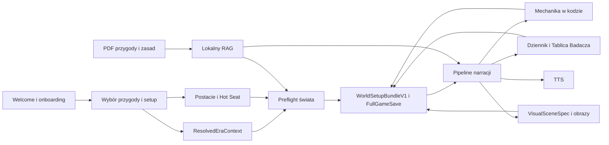

# Mapa powiązań runtime

Stan na 2026-09-01. Mapa opisuje faktyczny runtime w `_tester/_base/.silnik`.
Root `docs/` jest źródłem prawdy dokumentacji. `navigation/navigation-registry.json`
jest źródłem prawdy nawigacji. Istniejący graf Graft jest materiałem pomocniczym,
nie dowodem aktualnego przebiegu runtime.

## Główny przepływ gry

## Kontrakty między systemami

| Producent | Kontrakt | Konsument | Trwałość |
|---|---|---|---|
| Setup epoki | `ResolvedEraContext` | preflight, prompty, ekwipunek, obrazy | `FullGameSave.worldSetup` i stan sesji |
| Manifest epoki | `EraManifestV1` | preflight i centralny kontrakt promptów | wersjonowane dane runtime |
| Analiza przygody i preflight | `WorldSetupBundleV1` | chat, pamięć, save/load | `FullGameSave.worldSetup` |
| Specyfikacja sceny | `VisualSceneSpec` | adapter obrazu i test promptu | cache obrazu i metadata |
| Kreator postaci | `Character` | Hot Seat, karta, mechanika, save | localStorage i `FullGameSave` |
| Katalog ekwipunku | `templateId` i `EquipmentItem` | postać, dziennik, renderer | save i lokalny asset WebP |
| Wynik testu | wynik mechaniczny z kodu | narracja i dziennik | wiadomości i save |
| Lokalny RAG | trafienia z namespace rules, adventure, mythos, memory | preflight i chat | dane na dysku |
| Rejestr nawigacji | 31 węzłów i 30 akcji | guard, generator mapy, E2E | JSON w runtime |

## Granice odpowiedzialności

- Kod ustala mechanikę, stan gry, dostępność, ceny i wybór wyposażenia.
- AI redaguje narrację i opis, ale nie zmienia po cichu kanonu zapisanego w `WorldSetupBundleV1`.
- Każda ścieżka epoki ma używać `ResolvedEraContext`. Brak roku nie może dawać cichego fallbacku do 1920.
- Research online może działać przed sesją, ale nie podczas gry.
- Katalogowy przedmiot nie uruchamia API obrazu. Brak WebP daje ikonę kategorii.
- Samodzielny runtime nie może zależeć od danych istniejących wyłącznie w wrapperze.
- Dokumentacja systemowa żyje w root `docs/`; kopie runtime są generowane albo usuwane.

## Stan grafu i nawigacji

- `graft/.graph/wiring.json` ma 203 węzły i 377 krawędzi, ale pochodzi z commitu z 2026-08-24 i indeksuje głównie stare skrypty patchujące.
- Polecenie `graft` nie jest dostępne w środowisku, więc grafu nie można dziś odtworzyć ani uznać za żywy gate.
- Rejestr nawigacji ma 11 tras, 18 modali, 2 stany i 30 akcji. Jest sprawdzany przez `navigation:check` oraz `navigation:guard`.
- Faktyczny przepływ należy potwierdzać testami runtime i E2E, nie samym grafem statycznym.
