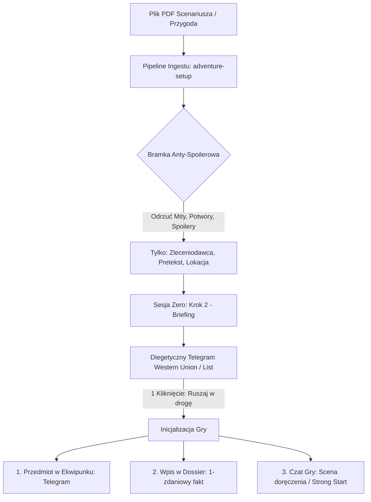

# Raport Badawczy: Analiza Poradników MG i Korpusu Prowadzenia – Próg Wejścia do Sesji Śledczej

> **Dokument powiązany:** GitHub Issue #405 (`research(narrative): analiza poradników MG i korpusu prowadzenia w kontekście przygotowania gracza do sesji i progu wejścia`)  
> **Status:** Zatwierdzony przez Product Ownera (Jakub Orłowski) w trybie `/grill-me`  
> **Data:** 2026-09-19  
> **Autorzy:** Zespół Architektury i Narracji Strażnika Tajemnic AI  

---

## 1. Cel Researchu i Źródła Badawcze

Celem badania jest wyeliminowanie barier poznawczych i tarcia na wejściu do gry (*friction-to-play*), szczególnie gdy gracz rozpoczyna nową rozgrywkę z własnym plikiem PDF scenariusza lub wybiera gotową przygodę.

Analiza integruje cztery filary wiedzy mistrzowskiej i erpegowej:
1. **Księga Strażnika Call of Cthulhu 7e RAW (Chaosium):** oficjalne reguły tworzenia wstępu do śledztwa, hooków na badaczy oraz zarządzania informacją bez naruszania tajemnicy Mitów.
2. **Robin's Laws of Good Game Mastering (Robin D. Laws):** typologia graczy, call-to-adventure, redukcja paraliżu decyzyjnego i tempo ekspozycji.
3. **Return of the Lazy Dungeon Master (Mike Shea):** zasada *Strong Start*, unikanie nadmiarowego przygotowania (*over-prep*) oraz projektowanie natychmiastowego punktu zaczepienia.
4. **Korpus 35 sesji actual-play Zew Cthulhu (baza AIOS-Vault):** synteza technik mistrzowskich z polskich i zagranicznych sesji (m.in. "Listopadowe Noce", "Order of the Stone"), w tym technika cięć montażowych, materialnych wskazówek oraz eliminacja sztucznych retrospekcji i baniek czasu.

---

## 2. Odpowiedzi na Główne Pytania Badawcze

### Pytanie 1: Ile gracz powinien wiedzieć o scenariuszu przed rozpoczęciem gry, by zachować immersję i nie psuć tajemnicy?

#### Wnioski z literatury i korpusu:
- **Księga Strażnika CoC 7e (s. 200-205):** Badacze wkraczają do opowieści jako zwykli ludzie w realiach lat 20. XX wieku. Nie posiadają wiedzy o Mitach Cthulhu (Mity = 00%). Jakakolwiek przedwczesna wzmianka o Wielkich Przedwiecznych, plugawych kultach czy nadnaturalnych istotach niszczy fundament horroru kosmicznego (*Cosmic Horror* bazuje na szoku poznawczym).
- **Robin's Laws of Good Game Mastering:** Gracz potrzebuje precyzyjnego **wezwania do przygody (Call to Adventure)**. Paraliż decyzyjny powstaje, gdy gracz wie za dużo (natłok wątków) albo za mało (brak motywacji i celu). Wystarczą dokładnie trzy elementy:
  1. **Zleceniodawca / Źródło impulsu:** Kto wzywa badacza (np. stary znajomy, zaniepokojona rodzina, zlecenie redakcyjne, telegram od profesora).
  2. **Pretekst i pozorna przyczyna (Mundane Cover):** Zwyczajne, racjonalne wytłumaczenie sprawy (np. zniknięcie spadkobiercy, kradzież rzadkiego manuskryptu z biblioteki, dziwne odgłosy w piwnicy nowo nabytej posiadłości).
  3. **Miejsce i czas zbiórki / pierwszego kroku:** Gdzie i kiedy badacz ma się stawić.
- **Fair Play Mystery & Vacuum Variable (z Kompendium Narracji):** Wszelkie anomalie muszą być ukryte pod powierzchnią normalności. Gracz ma widzieć brakujący element układanki (zmienną próżni), a nie gotowe odpowiedzi.

#### Dyrektywa dla Ekstrakcji z PDF (Filtr Anty-Spoilerowy):
Podczas wgrywania przez gracza dowolnego pliku PDF scenariusza, moduł ingestujący (`adventure-setup`) stosuje **bezwzględną bramkę anty-spoilerową**:
- **EKSTRAHOWANE DO BRIEFINGU:**
  - Imię/funkcja zleceniodawcy lub nadawcy wiadomości,
  - Pretekst wezwania (jawny cel śledztwa),
  - Lokacja początkowa (miasto, adres, czas akcji).
- **ZAKAZANE W BRIEFINGU (BLOKADA SYSTEMOWA):**
  - Nazwy bóstw Mitów, ksiąg bluźnierczych (np. Necronomicon), zaklęć i potworów,
  - Nazwiska zdrajców, tożsamości kultystów i rozwiązanie intrygi,
  - Opisy zakończeń scenariusza oraz wskazówki meta dla Mistrza Gry.

---

### Pytanie 2: Jak zaprojektować rozmowę wprowadzającą (Krok 2 Sesji Zero / Briefing), aby nie stwarzała bariery poznawczej dla gracza z własnym plikiem PDF?

#### Diagnoza dotychczasowego rozwiązania:
Dotychczasowy Krok 2 w `session-zero-modal.tsx` wdrażał mini-czat z trzema kolejnymi pytaniami zadanymi przez model AI (motywacja badacza, powiązanie ze sprawą, kotwica).
- **Wada krytyczna (Bariera Poznawcza):** Gracz, który właśnie wybrał postać i wgrał scenariusz, był zmuszany do odpowiadania na otwarte pytania o powiązanie z historią, której szczegółów jeszcze nie zna.
- **Efekt:** Syndrom pustej kartki (*Blank Page Syndrome*), oczekiwanie na odpowiedzi LLM, tarcie poznawcze i frustracja przed rozpoczęciem właściwej rozgrywki.
- **Ukryty potencjał w kodzie:** W pliku `session-zero-modal.tsx` istniał już przygotowany, w pełni ostylowany diegetyczny komponent `renderBriefingDocument` (telegram Western Union, list zleceniodawcy, poufne dossier), który jednak pozostawał niepodpięty (martwy kod).

#### Decyzja Projektowa (Uproszczenie Kroku 2):
1. **Likwidacja mini-czatu:** Wycofujemy 3-etapowy wywiad czatowy z Kroku 2 Sesji Zero.
2. **Aktywacja Diegetycznego Dokumentu:** Krok 2 staje się czytelnym, klimatycznym ekranem **Briefingu Śledczego**. Gracz widzi stylizowany dokument (telegram Western Union, list na papeterii lub dossier agencyjne) zawierający wyekstrahowany hak fabularny.
3. **Zero-Effort Progression:** Gracz może natychmiast kliknąć **"Dalej / Przyjmij zlecenie"** jednym kliknięciem myszy.
4. **Opcjonalna Notatka (Non-blocking):** Gracz zachowuje możliwość dopisania własnego, opcjonalnego zdania (np. *"Znam zleceniodawcę ze studiów na Miskatonic"*), ale nie jest do tego w żaden sposób zmuszany.

---

### Pytanie 3: Czy wprowadzenie diegetycznego telegrafu/listu otwierającego jest wystarczające, by gracz mógł zacząć grę natychmiast po wgraniu podręcznika?

#### Wnioski z "Return of the Lazy Dungeon Master" (Strong Start):
- Sam dokument na ekranie wstępnym jest doskonałym punktem wejścia, ale wymaga **płynnego przejścia do pierwszej sceny w grze**.
- Mike Shea definiuje *Strong Start* jako sytuację, w której gra nie zaczyna się od pytania *"obudziłeś się rano, co robisz?"*, lecz od momentu, w którym coś się dzieje lub postać stoi bezpośrednio przed drzwiami wyzwania.

#### Spójność z Żelaznymi Inwariantami Silnika (Zero-Effort Ledger & Stan 10 Sekund):
Zgodnie z ustaleniami z Product Ownerem (Jakub Orłowski) wdrożony zostaje potrójny byt dokumentu otwierającego:
1. **W Sesji Zero (Krok 2):** Gracz zapoznaje się z telegramem / listem jako ekspozycją sprawy.
2. **W Ekwipunku Badacza (Fizyczny Rekwizyt):** Po kliknięciu startu gry, telegram automatycznie ląduje w ekwipunku postaci (kategoria `Dokumenty i Listy`, waga `0.0 kg`), gotowy do podejrzenia w diegetycznym czytniku w dowolnym momencie.
3. **W Dossier Śledczym (Fakt w Aktach Sprawy):** Automatyczny protokolant w tle rejestruje 1-zdaniową poszlakę wyjściową (np. `[DZIENNIK:poszlaka:Zlecenie] Telegram od prof. Armitage'a wzywający do pilnego przyjazdu do Arkham.[/DZIENNIK]`).
4. **Strong Start w Czacie Gry:** Pierwsza wypowiedź Strażnika Tajemnic (LLM) rozpoczyna się od sceny doręczenia lub odczytania depeszy (np. posłaniec w strugach deszczu na progu biura badacza / stukot kół pociągu zbliżającego się do stacji z depeszą w zaciśniętej dłoni) i natychmiast stawia gracza przed pierwszą decyzją: **`[Co robisz?]`**.

---

## 3. Architektura Przepływu (Przepływ Danych od PDF do Czatu)

---

## 4. Kontrakt Techniczny PRP (Product Requirement Package) dla Issue #405

Na podstawie powyższych ustaleń zdefiniowano ścisły kontrakt wdrożeniowy:

### A. Dozwolone Pliki (Allowlist)
- `_tester/_base/.silnik/src/components/ui/session-zero-modal.tsx` – podpięcie komponentu `renderBriefingDocument` w `case 2` renderowania kroków; usunięcie mini-czatu z 3 pytaniami; zachowanie edytowalnego pola notatki;
- `_tester/_base/.silnik/src/lib/prompts/session-zero-instructions.ts` – usunięcie instrukcji dla 3-etapowego wywiadu czatowego, uproszczenie do generowania briefingu;
- `_tester/_base/.silnik/messages/pl.json` oraz `_tester/_base/.silnik/messages/en.json` – aktualizacja kluczy i18n dla Kroku 2 (usunięcie fraz wywiadu, zachowanie etykiet telegramu i briefingu w 100% symetrii);
- `_tester/_base/.silnik/src/hooks/useGameStart.ts` (lub powiązany generator stanu startowego) – upewnienie się, że wygenerowany briefing/telegram trafia do ekwipunku postaci startowej jako pierwszy handout.

### B. Zakazane Ścieżki (Denylist)
- `root/src/*` – bezwzględny zakaz edycji (kod silnika wyłącznie w `_tester/_base/.silnik/src/`);
- Pliki mechanik regułowych CoC 7e (`combat-service.ts`, `sanity-service.ts`, `chase-service.ts`, `dice-service.ts`);
- Kreator Badacza (`character-creator-modal.tsx`).

### C. Świadome Wykluczenia (Anti-scope)
- Nie zmieniamy Kroku 1 (Konwencja: Pulp vs Purist) ani Kroku 3 (Kotwice badacza);
- Nie modyfikujemy integracji audio ani systemu map;
- Nie zmieniamy struktury zapisu bazy danych scenariuszy.

### D. Audyt Zero-Effort Ledger & d100 Weird Fiction
- Pełna realizacja potrójnego bytu handoutu (ekwipunek + modal czytnika + wpis w Dossier);
- Zero przymusu ręcznego notowania przez gracza;
- Transparentny, natychmiastowy start śledztwa.

### E. Bramka Testowa (Test Exit Criteria)
- `npm run qa:quick` (weryfikacja i18n, nawigacji i kompilacji TypeScript) zakończona kodem 0;
- Testy jednostkowe `session-zero-modal.test.tsx` zaktualizowane i zielone;
- Bramka 10 sekund: po `desktop/cold-start.sh` gracz wchodzi do Sesji Zero, widzi stylowy telegram w Kroku 2, klika "Dalej", a po wejściu do czatu ma telegram w ekwipunku.

---

## 5. Podsumowanie Wdrożeniowe

Przeprowadzony research rozwiązuje fundamentalny problem progu wejścia do gry. Zamiast męczącego wywiadu, gracz otrzymuje natychmiastowy, diegetyczny artefakt wprowadzający w klimat lat 20. XX w., który łączy świat scenariusza z kartą postaci bez spoilerów i bez zbędnych pytań.
