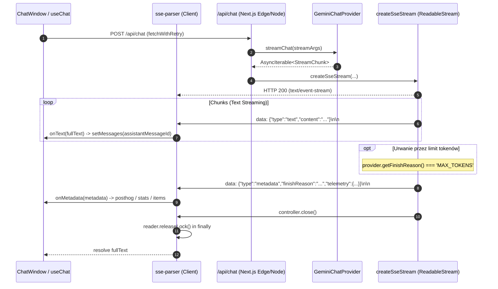

# Audyt Warstwy Transportu SSE, Odporności na Zerwania i Wznawiania Narracji (MAX_TOKENS)

- **Projekt:** Strażnik Tajemnic AI
- **Zgłoszenie:** GitHub Issue [#77](https://github.com/InduPhantom-hash/straznik-tajemnic/issues/77)
- **Data audytu:** 2026-09-06
- **Status wykonania:** Zrealizowany (Analiza architektury + Weryfikacja testowa + Zestaw testów jednostkowych)
- **Powiązanie architektoniczne:** Epik #2 (Audyt architektury i stabilizacji)

---

## 1. Streszczenie wykonawcze (Executive Summary)

Komunikacja między interfejsem gracza a silnikiem narracji Mistrza Gry (`/api/chat`) opiera się na protokole **Server-Sent Events (SSE)**. W przeciwieństwie do tradycyjnych żądań typu Request-Response, SSE zapewnia iluzję natychmiastowej reakcji AI (niski TTFT - *Time To First Token*) oraz strumieniuje tekst sceny na żywo do syntezatora mowy (TTS).

Niniejszy audyt zweryfikował 4 krytyczne filary stabilności transportu:
1. **Odporność na zerwania i fluktuacje sieci (Network Blip & Packet Fragmentation):**
   - Mechanizm `fetchWithRetry` izoluje chwilowe błędy sieciowe (do 2 ponowień z rosnącym backoffem), nie powtarzając deterministycznych błędów HTTP (4xx/5xx).
   - Wewnętrzny bufor `buffer` w `src/lib/sse-parser.ts` chroni pakiety JSON przed rozerwaniem na granicach ramek TCP (zapobiegając `SyntaxError` przy dużych pakietach metadanych).
2. **Spójność stanu wiadomości i eliminacja duplikacji bąbelków czatu:**
   - Flaga `isLoading` w `useChat` oraz synchroniczny rygiel `continuationInFlightRef` uniemożliwiają wyścigi zdarzeń (*race conditions*) przy szybkich kliknięciach lub podwójnym wciśnięciu Enter.
   - Identyfikator wiadomości asystenta (`assistantMessageId`) jest generowany synchronicznie przed rozpoczęciem strumienia; aktualizacje tekstu i metadanych mapują precyzyjnie istniejący węzeł stanu, zapobiegając powstawaniu osieroconych dymków.
3. **Wznawianie uciętej narracji (`finishReason === 'MAX_TOKENS'`):**
   - Backend przekazuje `finishReason` w końcowym zdarzeniu metadanych SSE.
   - W UI aktywuje się dedykowany przycisk `t('continueNarration')` w ostatniej wiadomości MG.
   - Wysłanie kontynuacji odbywa się bez generowania sztucznego dymku użytkownika (ukryta instrukcja systemowa), a poprzednia wiadomość otrzymuje `continuationRequested: true`, blokując wielokrotne zamówienia.
4. **Zarządzanie zasobami i cykl życia połączeń HTTP:**
   - Parser `parseSSEStream` bezwzględnie zwalnia blokadę czytnika (`reader.releaseLock()`) w bloku `finally`.
   - Backend zamyka strumień po zakończeniu generowania (`controller.close()`).
   - Zidentyfikowano punkt usprawnienia: brak integracji `AbortController` z cyklem życia komponentu (anulowanie żądania przy opuszczeniu sesji gry).

---

## 2. Architektura Przepływu Danych SSE (Data Flow Architecture)



---

## 3. Szczegółowe Wyniki Audytu Filarów Stabilności

### 3.1. Odporność na niestabilne łącze i fragmentację chunków TCP

- **Wielokrotne próby połączenia (`fetchWithRetry`):**
  - Plik: `src/hooks/useChat.ts` oraz `src/hooks/useGameStart.ts`.
  - Mechanizm rozpoznaje błędy sieciowe przez `isNetworkBlip(error)` (np. `TypeError: Failed to fetch`).
  - Wykonuje do 2 ponowień z wykładniczym opóźnieniem (`backoffMs * (attempt + 1)`).
  - W razie całkowitego zerwania łącza nie crashuje aplikacji, lecz podstawia czytelny komunikat błędu z informacją o problemie z połączeniem.
- **Problem pękniętych pakietów TCP (JSON split across chunks):**
  - Plik: `src/lib/sse-parser.ts`.
  - Duże zdarzenia SSE (szczególnie `type: 'metadata'` zawierające listę ilustracji, testy umiejętności, ekwipunek i telemetrię) często przekraczają rozmiar pojedynczej ramki MTU sieci.
  - Zastosowano bufor łańcuchowy `let buffer = ''`, który dzieli dane po `\n` i odkłada ostatni, niedokończony fragment na kolejną iterację pętli `reader.read()`.
  - **Pokrycie testowe:** Dodano test weryfikujący podział JSON na 3 niezależne pakiety `['data: {"type":"text","con', 'tent":"...', '...']` – parser bezbłędnie składa treść.

### 3.2. Spójność stanu wiadomości i brak duplikacji bąbelków

- **Wyścigi zdarzeń (Race Conditions):**
  - W `useChat.ts` funkcja `handleSendMessage` posiada twardą blokadę `if (isLoading) return;`.
  - Identyfikator `assistantMessageId = crypto.randomUUID()` jest tworzony przed `fetchWithRetry` i wstawiany do stanu jako placeholder `{ id, role: 'assistant', content: '' }`.
  - W callbacku `onText`:
    ```typescript
    setMessages((prev) =>
      prev.map((msg) =>
        msg.id === assistantMessageId ? { ...msg, content: cleanText } : msg
      )
    );
    ```
  - Dzięki operowaniu po unikalnym ID asystenta, nawet w przypadku opóźnień w re-renderze Reacta, nie powstają duplikaty wiadomości.
- **Obsługa awarii w trakcie streamu:**
  - Jeśli strumień zostanie przerwany w trakcie przesyłania treści (np. zerwanie kabla po wysłaniu 3 słów), `parseSSEStream` rzuca wyjątek.
  - Blok `catch` w `useChat` przechwytuje błąd, wysyła telemetrię do PostHog/Sentry i zamienia treść wiadomości na komunikat przyjazny dla gracza (`friendly`), usuwając stan zawieszenia `isLoading: false`.

### 3.3. Obsługa urwanej narracji (`finishReason === 'MAX_TOKENS'`)

- **Detekcja ucięcia:**
  - W `src/app/api/chat/_helpers/create-sse-stream.ts` backend odczytuje `getFinishReason()` z providera Gemini/OpenAI.
  - Wartość ta jest emitowana w końcowym obiekcie `metadata` i zapisywana w wiadomości: `msg.finishReason = metadata.finishReason`.
- **Interfejs użytkownika:**
  - W `src/components/chat/chat-window/components/message-card.tsx` warunek `isLastMessage && message.finishReason === 'MAX_TOKENS'` renderuje przycisk "Kontynuuj narrację".
- **Logika wznawiania (`handleContinueNarration`):**
  - Używa synchronicznego `continuationInFlightRef = useRef(false)`, zapobiegając wielokrotnym kliknięciom w przycisk.
  - Nadaje wiadomości flagę `continuationRequested: true`, co natychmiast blokuje przycisk w UI (`disabled`).
  - Wysyła do `/api/chat` specjalną instrukcję dokończenia wątku:
    - PL: *"Dokończ poprzednią, urwaną wypowiedź Mistrza Gry dokładnie od miejsca, w którym się skończyła. Nie powtarzaj jej i nie komentuj przerwania."*
    - EN: *"Continue the Game Master's previous truncated response exactly where it ended. Do not repeat it and do not comment on the interruption."*
  - Nie dodaje do czatu nowego dymka gracza (instrukcja leci w tle), a jedynie nowy dymek asystenta z dokończeniem sceny.

### 3.4. Cykl życia połączeń i zarządzanie zasobami

- **Zwalnianie blokad (Stream Reader Lock):**
  - `parseSSEStream` zamyka czytnik w bloku `finally`:
    ```typescript
    try {
      while (true) {
        const { done, value } = await reader.read();
        if (done) break;
        // ...
      }
    } finally {
      reader.releaseLock();
    }
    ```
  - Nawet w przypadku nieoczekiwanego błędu sieci, lock jest zwalniany, co zapobiega wyciekom pamięci w środowisku przeglądarkowym.
- **Zamknięcie strumienia po stronie serwera:**
  - `createSseStream` wywołuje `controller.close()` po wysłaniu metadanych i uruchomieniu asynchronicznych zadań telemetrii/pamięci.

---

## 4. Wnioski i Rekomendacje Architektoniczne

| Obszar | Ocena | Status | Zalecenie |
|---|:---:|:---:|---|
| **Buforowanie ramek TCP** | A+ | Wdrożone i przetestowane | Brak uwag. Zabezpiecza przed SyntaxError. |
| **Odporność na blipy sieci** | A | Wdrożone (`fetchWithRetry`) | Zapewnia 2 próby ponowienia przed błędem. |
| **Mechanizm MAX_TOKENS** | A+ | Wdrożone i przetestowane | Wzorcowa obsługa bez zaśmiecania czatu wiadomościami gracza. |
| **Zwalnianie zasobów (releaseLock)** | A | Wdrożone | Lock zawsze zwalniany w `finally`. |
| **Obsługa AbortController (Anulowanie)** | B | Do rozważenia w v0.9.5 | Dodać przekazywanie `AbortSignal` z hooka do `fetchWithRetry` i parsera przy odmontowaniu widoku lub resecie sesji. |

---

## 5. Zrealizowane Testy Weryfikacyjne

1. `src/lib/sse-parser.test.ts`:
   - Kompletne przetwarzanie strumienia tekstu i metadanych (PASS).
   - Przetwarzanie tokenów rozciętych pomiędzy chunkami TCP (PASS).
   - Flush resztek bufora bez końcowego `\n` (PASS).
   - Odporność na uszkodzony JSON w linii `data:` (PASS).
   - Weryfikacja zwolnienia `reader.releaseLock()` przy przerwaniu strumienia (PASS).
   - Eskalacja błędów callbacków do Sentry z pominięciem SyntaxError z bufora (PASS).
2. `src/hooks/useChat.truncation.test.tsx`:
   - Zapisywanie `finishReason === 'MAX_TOKENS'` na wiadomości (PASS).
   - Odtwarzanie stanu ucięcia ze starego `localStorage` (PASS).
   - Jednokrotne wysłanie ukrytej kontynuacji bez dymku gracza (PASS).
3. `src/app/api/chat/_helpers/create-sse-stream.test.ts`:
   - Propagacja `finishReason` do metadanych SSE i telemetrii (PASS).
