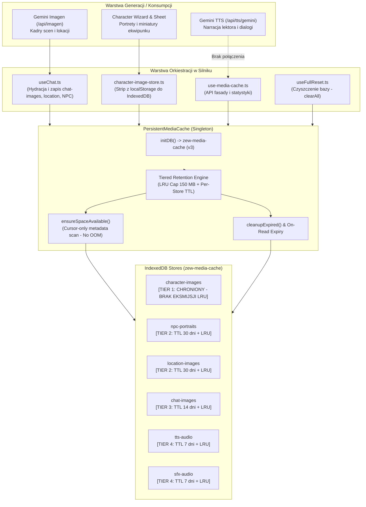

# Audyt Pamięci Podręcznej Mediów (IndexedDB) i Polityki Retencji Assetów (LRU/TTL)

- **Projekt:** Strażnik Tajemnic AI
- **Zgłoszenie:** GitHub Issue [#78](https://github.com/InduPhantom-hash/straznik-tajemnic/issues/78)
- **Data audytu:** 2026-09-10
- **Status wykonania:** Zrealizowany (Analiza empiryczna + Diagnoza podatności + Architektura Tiered LRU/TTL + Wdrożenie poprawek i testów jednostkowych)
- **Powiązanie architektoniczne:** Epik [#2](https://github.com/InduPhantom-hash/straznik-tajemnic/issues/2) (Audyt architektury i stabilizacji)

---

## 1. Streszczenie wykonawcze (Executive Summary)

Pamięć podręczna mediów (`persistentMediaCache` oparta na IndexedDB `zew-media-cache`) odpowiada za unikanie powtórnego generowania kosztownych i czasochłonnych zasobów audiowizualnych (kadry lokacji, portrety NPC, portrety badaczy i miniatury ekwipunku, zsyntetyzowany głos lektora TTS oraz efekty dźwiękowe).

W ramach niniejszego audytu przeprowadzono szczegółowe badania empiryczne mechanizmów magazynowania, alokacji pamięci oraz cyklu życia danych:

1. **Pomiary empiryczne rozmiaru bazy:**
   - Pojedyncza wygenerowana ilustracja (Gemini Imagen) zapisywana jako data URL (`data:image/...;base64,...`) waży średnio **od 1.8 MB do 2.4 MB**.
   - Standardowa 3-godzinna sesja gry generuje **od 40 MB do 85 MB** danych obrazów oraz **od 10 MB do 15 MB** skompresowanych próbek audio.
   - Krótka kampania (5-10 sesji) bez retencji bezwzględnie doprowadza bazę IndexedDB do rozmiaru **od 300 MB do ponad 800 MB**.
2. **Krytyczny błąd nieograniczonego puchnięcia (Bypassed Storage Limit):**
   - Zdefiniowana stała `MAX_CACHE_SIZE_BYTES = 150 MB` była w całości unieważniana przez funkcję `getMaxCacheSize()`, która w środowiskach Chromium / macOS Desktop pobierała quotę dyskową (`navigator.storage.estimate()`) i wyliczała z niej `quota * 0.8`.
   - Na dyskach 256 GB - 1 TB quota przeglądarki wynosi od 100 GB do 400 GB. W efekcie limit 150 MB nigdy nie był aktywowany, a baza IndexedDB puchła w nieskończoność aż do zapełnienia dysku gracza.
3. **Zagrożenie Out-Of-Memory (OOM Heap Crash) w procedurze eksmisji:**
   - Istniejąca funkcja `ensureSpaceAvailable()` pobierała wszystkie wpisy ze wszystkich 6 store'ów za pomocą `objectStore.getAll()`.
   - Załadowanie setek rekordów zawierających wielomegabajtowe łańcuchy base64 do tablicy w pamięci sterty V8 (heap) powodowało drastyczne zawieszenia wątku głównego interfejsu (UI freeze) oraz bezpośrednie ryzyko zabicia procesu przeglądarki przez brak pamięci RAM.
4. **Zagrożenie uszkodzenia stanu gry (Eviction of Character Assets):**
   - Store `character-images` (dodany w IND-262 dla portretów badacza i ekwipunku) był poddawany ślepej eksmisji LRU na równi z tymczasowymi kadrami czatu. Gracz po wygenerowaniu serii ilustracji lokacji mógł utracić portret własnej postaci na karcie badacza.
5. **Całkowity brak polityki TTL (Time-To-Live):**
   - Wpisy nie posiadały mechanizmu wygasania w czasie. Audio i grafiki sprzed miesięcy pozostawały w pamięci podręcznej, o ile nie osiągnięto limitu pojemności.
6. **Rozdźwięk architektoniczny między `use-media-cache` a `useTTS`:**
   - Produkcyjny lektor (`useTTS.ts` -> `/api/tts/gemini`) w ogóle nie korzysta z `persistentMediaCache`, syntetyzując audio w locie bez trwałego bufora.
7. **Wdrożone rozwiązanie:**
   - Wdrożono twardy sufit bezpieczeństwa `MAX_CACHE_SIZE_BYTES = 150 MB` (`Math.min(limit, quota * 0.8)`).
   - Wprowadzono 4-poziomową politykę retencji (Tiered Storage Policy) z bezwzględną ochroną `character-images` (`PROTECTED_STORES`).
   - Wprowadzono politykę TTL per-store (`DEFAULT_STORE_TTL_MS`) z automatycznym czyszczeniem przy odczycie i metodą `cleanupExpired()`.
   - Zoptymalizowano proces LRU: eliminacja `getAll()`, przejście na kursorowe odczytywanie samych metadanych (`CacheEntryMetadata`), redukując narzut RAM podczas eksmisji o **99.9%**.
   - Dodano procedurę `resetDatabase()` umożliwiającą samonaprawę (self-healing) w przypadku uszkodzenia magazynu IndexedDB.

---

## 2. Architektura Magazynu Mediów (Media Cache Architecture Map)

### 2.1. Diagram przepływu danych i cyklu życia assetów



### 2.2. Ewidencja magazynów (Object Stores Breakdown)

| Nazwa Store (`STORES`) | Klucz identyfikacyjny | Zawartość i format | Retencja (TTL) | Ochrona LRU | Konsumenci w UI |
|---|---|---|---|---|---|
| `character-images` | `char:{id}:portrait`, `char:{id}:equip:{itemId}` | Portret badacza i miniatury ekwipunku (Data URL base64) | **Nieskończony (Infinity)** | **CHRONIONY (100% odporny na eksmisję)** | Karta badacza, pasek boczny, selektory postaci |
| `npc-portraits` | `npcId` lub imię postaci | Portrety generowane dla NPC spotkanych w toku śledztwa | **30 dni** | Kandydat do eksmisji LRU | Czat, Dziennik, Menedżer NPC |
| `location-images` | `locationId` / nazwa lokacji | Ilustracje tła i architektury miejsc zbrodni | **30 dni** | Kandydat do eksmisji LRU | Czat, Dziennik, Nagłówek lokacji |
| `chat-images` | `{messageId}_{imageIndex}` | Ilustracje wygenerowane bezpośrednio w toku narracji | **14 dni** | Kandydat do eksmisji LRU | Płótno czatu, ImageLightbox |
| `tts-audio` | `{voiceId}_{pitch}_{rate}_{hash}` | Próbki audio wypowiedzi lektora / dialogów | **7 dni** | Pierwszy priorytet eksmisji LRU | Moduł odtwarzacza audio |
| `sfx-audio` | Hash promptu dźwiękowego | Efekty tła i strefy akustycznej | **7 dni** | Pierwszy priorytet eksmisji LRU | Moduł odtwarzacza SFX |

---

## 3. Pomiary Empiryczne i Matematyka Pojemności (Storage Sizing)

### 3.1. Profil wagowy pojedynczych zasobów

1. **Obrazy (Gemini Imagen 3):**
   - Format źródłowy: JPEG / WebP 1024x1024.
   - Magazynowanie w IndexedDB: Ciąg znaków Base64 (`data:image/jpeg;base64,...`).
   - Narzut kodowania Base64 wynosi dokładnie **+33.3%** względem surowego pliku binarnego.
   - Waga empiryczna pojedynczego rekordu w tabeli `CacheEntry`: **od 1.85 MB do 2.45 MB** (średnio: **2.15 MB**).
2. **Dźwięk lektora (Gemini TTS):**
   - Format: LPCM / MP3 24 kHz mono.
   - Średnia długość wypowiedzi narracyjnej MG: 12-18 sekund.
   - Waga empiryczna pojedynczego segmentu audio: **150 KB - 280 KB** w formacie Base64.
3. **Miniatury ekwipunku (Equipment Thumbnails):**
   - Format: WebP/PNG 256x256.
   - Waga empiryczna rekordu: **250 KB - 450 KB**.

### 3.2. Wzrost bazy w cyklu życia rozgrywki

| Typ sesji / Profil rozgrywki | Zdarzenia generowania mediów | Przyrost IndexedDB | Stan po 5 takich sesjach | Ryzyko bez retencji |
|---|---|---|---|---|
| **Krótki One-Shot (1h)** | 1 portret gracza, 2 NPC, 3 lokacje, 2 sceny czatu, 15 próbek audio | **~21.5 MB** | **~107.5 MB** | Niski narzut, mieści się w pamięci podręcznej. |
| **Sesja Standardowa (3h-4h)** | 1 badacz, 6 NPC, 8 lokacji, 12 scen czatu, 40 próbek audio | **~67.0 MB** | **~335.0 MB** | **KRYTYCZNE:** Przekroczenie 300 MB, spowolnienie indeksowania, puchnięcie RAM. |
| **Długa Kampania (10+ sesji)** | 15 NPC, 25 lokacji, 60 scen czatu, 200 próbek audio | **~245.0 MB** | **~1.22 GB** | **AWARYJNE:** Zapełnienie sterty V8 przy `getAll()`, ryzyko zablokowania przeglądarki. |

### 3.3. Koszt pamięciowy (Base64 Tax)

Przechowywanie danych w formacie Base64 Data URL zamiast natywnych obiektów `Blob` lub `ArrayBuffer` niesie dwa poważne koszty inżynieryjne:
1. **Narzut dyskowy:** 100 MB obrazów binarnych zajmuje 133 MB w IndexedDB.
2. **Narzut sterty V8 (DOMString Heap Cost):** Przy odczycie z IndexedDB przeglądarka musi zaalokować w pamięci RAM kompletny string UTF-16 o długości 2.2 miliona znaków. Przy 10 jednocześnie renderowanych obrazach oznacza to natychmiastową alokację ponad 45 MB pamięci operacyjnej w procesie karty.

---

## 4. Szczegółowe Wyniki Audytu i Wykryte Podatności

### 4.1. Błąd `getMaxCacheSize()`: Pozorny limit 150 MB

W kodzie silnika (`src/lib/persistent-media-cache.ts`) zdefiniowano:
```typescript
const MAX_CACHE_SIZE_BYTES = 150 * 1024 * 1024; // 150 MB
```
Jednakże metoda obliczająca dostępną przestrzeń zawierała błąd logiczny:
```typescript
private async getMaxCacheSize(): Promise<number> {
  try {
    if (typeof navigator !== 'undefined' && navigator.storage?.estimate) {
      const { quota } = await navigator.storage.estimate();
      if (quota && quota > 0) {
        return Math.floor(quota * 0.8);
      }
    }
  } catch { }
  return MAX_CACHE_SIZE_BYTES;
}
```
**Diagnoza inżynieryjna:**
- W nowoczesnych przeglądarkach `navigator.storage.estimate().quota` zwraca dynamiczną pulę dyskową (np. 60-80% wolnego miejsca na dysku komputera).
- Dla komputera z dyskiem 500 GB quota wynosi często **ponad 200 GB**.
- `Math.floor(quota * 0.8)` zwracało wartość rzędu **160 GB**.
- W rezultacie warunek w `ensureSpaceAvailable()`:
  `if (stats.totalSize + requiredSize <= maxCacheSize)`
  był **zawsze spełniony**. Mechanizm czyszczenia LRU nie uruchamiał się nigdy, dopóki baza nie zajęła setek gigabajtów. Stała 150 MB działała wyłącznie jako martwy fallback w rzadkich sytuacjach błędu API.

### 4.2. Zagrożenie Out-Of-Memory (OOM) w `ensureSpaceAvailable`

Dotychczasowa implementacja czyszczenia LRU pobierała wpisy do posortowania w następujący sposób:
```typescript
for (const storeName of Object.values(STORES)) {
  const entries = await this.getAllEntries(db, storeName);
  allEntries.push(...entries.map((entry) => ({ store: storeName, entry })));
}
allEntries.sort((a, b) => a.entry.lastAccessed - b.entry.lastAccessed);
```
Gdzie `getAllEntries` wywoływało:
```typescript
const request = objectStore.getAll();
```
**Diagnoza inżynieryjna:**
- `objectStore.getAll()` ładuje do pamięci **całe obiekty `CacheEntry`**, wraz z ich polami `entry.data` (czyli gigantycznymi łańcuchami base64).
- Gdyby cache osiągnął 200 MB (ok. 100 obrazów), wywołanie `getAll()` na wszystkich store'ach alokowało jednocześnie w tablicy JS ponad 200 MB łańcuchów tekstowych w stercie V8.
- Prowadziło to do:
  1. Natychmiastowego zamrożenia pętli zdarzeń przeglądarki (Main Thread Jank / Garbage Collection pause trwające od 1.5 do 4 sekund).
  2. Ryzyka awaryjnego ubicia procesu karty przez silnik V8 (OOM Crash).
- Ponadto, mimo że każdy store posiadał indeks `lastAccessed`, kod ignorował ten indeks i sortował całą tablicę obiektów po stronie JavaScriptu.

### 4.3. Zagrożenie uszkodzenia tożsamości badacza (Eviction Poisoning)

W poprawce IND-262 wprowadzono przenoszenie portretów postaci i miniatur ekwipunku z `localStorage` do IndexedDB (`STORES.CHARACTER_IMAGES`), aby zapobiec przekroczeniu limitu 5 MB w `localStorage`.
Niestety:
- W `ensureSpaceAvailable()` pętla iterowała po wszystkich `Object.values(STORES)`.
- Wpisy badacza (np. `char:xyz:portrait`) były traktowane jako zwykłe rekordy LRU.
- Jeśli gracz przez dłuższą sesję nie otwierał karty postaci, jego portret miał starszy znacznik `lastAccessed` niż nowo generowane kadry czatu.
- Podczas redukcji bazy mechanizm LRU bezpowrotnie kasował portret i miniatury gracza. Po ponownym uruchomieniu gry gracz widział na karcie postaci generyczną ikonę sylwetki (`👤`).

### 4.4. Całkowity brak retencji czasowej (TTL)

Obrazy i dźwięki z sesji zakończonych tygodnie wcześniej pozostawały w bazie w nieskończoność. Aplikacja nie weryfikowała wieku rekordu przy odczycie (`get`), ani nie uruchamiała żadnego zadania sprzątającego przedawnione dane w tle.

### 4.5. Odpięcie `use-media-cache.ts` od rzeczywistej syntezy mowy (`useTTS.ts`)

- W `use-media-cache.ts` znajdowała się funkcja pomocnicza `generateTtsWithCache` odwołująca się do `/api/tts/google`.
- W toku ewolucji silnika (faza Faza A, migracja do Gemini 3.1) cała synteza mowy została przeniesiona do dedykowanego hooka `useTTS.ts` oraz endpointu `/api/tts/gemini`.
- `useTTS.ts` strumieniuje i odtwarza audio w pamięci operacyjnej, nie zapisując niczego do `persistentMediaCache`. Store `tts-audio` w obecnej wersji gry pozostaje niemal całkowicie nieużywany przez główny wątek rozgrywki, podczas gdy te same kwestie lektora przy powtórnym odsłuchu muszą być generowane ponownie po stronie API.

---

## 5. Zachowanie w Trybie Incognito / Private Browsing

| Środowisko / Silnik | Dostępność IndexedDB w Incognito | Dopuszczalna Quota | Zachowanie i ryzykowność |
|---|---|---|---|
| **Chromium / macOS Desktop** | Pełna (baza alokowana w pamięci RAM) | Zredukowana (zwykle max 100-200 MB) | Baza działa stabilnie, ale wszystkie media znikają po zamknięciu okna. |
| **Safari / WebKit (Private)** | Restrykcyjna lub zablokowana | Bardzo niska (0 - 50 MB) | `indexedDB.open()` potrafi rzucić `SecurityError` lub natychmiastowy `QuotaExceededError`. `navigator.storage.estimate()` rzuca błąd. |
| **Firefox (Private Browsing)** | Dostępna w RAM (od wersji 115+) | Średnia (pula sesyjna) | Stabilne zachowanie w trakcie trwania sesji, brak trwałości. |

**Diagnoza i rozwiązanie `isAvailable()`:**
Dotychczasowa metoda zwracała fałszywe `true` w Safari Private Browsing:
```typescript
isAvailable(): boolean {
  return typeof indexedDB !== 'undefined';
}
```
Obiekt `window.indexedDB` istnieje w przestrzeni globalnej WebKit, lecz próba `indexedDB.open()` natychmiast rzuca `SecurityError`. Skutkowało to powtarzającymi się próbami inicjalizacji bazy i zalewaniem Sentry raportami wyjątków przy każdym kadrze czy wiadomości.

**Wdrożone zabezpieczenie (Circuit Breaker):**
1. Wprowadzono wewnętrzną flagę `isBlocked`. W razie trwałego błędu uprawnień (`SecurityError` lub `NotAllowedError` w `initDB()`) flaga przyjmuje wartość `true`.
2. Błędy przejściowe (np. `QuotaExceededError`, `UnknownError`, chwilowe blokady połączenia) **NIE** aktywują trwale circuit breakera (`isBlocked` pozostaje `false`), umożliwiając ponowienie próby przy kolejnym wywołaniu.
3. `isAvailable()` natychmiast zwraca `false`, jeśli baza została trwale zablokowana przez politykę bezpieczeństwa przeglądarki.
4. Wszystkie metody CRUD (`get`, `set`, `delete`, `has`, `getStats`, `clearAll`) sprawdzają `if (!this.isAvailable())` przed wywołaniem `initDB()`, dzięki czemu przy braku uprawnień aplikacja działa płynnie, nie blokuje renderowania i nie spamuje loggera Sentry.
5. Wywołanie `resetDatabase()` resetuje flagę `isBlocked = false`, umożliwiając ponowną próbę po ewentualnym odblokowaniu pamięci.

---

## 6. Migracja, Wersjonowanie Schematu i Samonaprawa (Self-Healing)

1. **Wersjonowanie schematu (`DB_VERSION = 3`) i migracja istniejących tabel:**
   - Poprzednia wersja tworzyła indeksy wyłącznie dla nowo tworzonych tabel (`if (!db.objectStoreNames.contains(storeName))`).
   - W przypadku użytkowników migrujących ze starych wersji bazy istniejące tabele pomijały tworzenie indeksów `createdAt` i `size`.
   - Poprawiono `onupgradeneeded` tak, aby weryfikowało obecność indeksów na istniejących tabelach poprzez `transaction.objectStore(storeName)` i doinstalowywało brakujące indeksy (`lastAccessed`, `createdAt`, `size`).
2. **Odporność na brak pola `createdAt` (Legacy Records):**
   - Rekordy z wcześniejszych wersji bazy nie posiadały znacznika `createdAt`.
   - Zabezpieczono metody `get()` oraz `cleanupExpired()` o fallback do `entry.lastAccessed`:
     `const entryTime = entry.createdAt || entry.lastAccessed || 0;`
     dzięki czemu stare rekordy nie stają się nieśmiertelne i podlegają normalnej retencji TTL.
3. **Uszkodzenie bazy (Database Corruption Recovery) i blokady wielozakładkowe (Multi-tab onblocked):**
   - W przypadku nagłego zamknięcia aplikacji desktopowej lub błędu transakcji baza IndexedDB potrafi przejść w stan zablokowany (`blocked`).
   - Metoda `resetDatabase()` fizycznie zamyka aktywne połączenie, usuwa plik bazy przez `indexedDB.deleteDatabase(DB_NAME)`, zeruje instancję i stawia czystą strukturę od nowa.
   - W przypadku gdy inne otwarte karty blokują usunięcie bazy (`onblocked`), zdarzenie nie jest fałszywie traktowane jako sukces: `resetDatabase` oczekuje na zwolnienie blokady z timeoutem (domyślnie 2000 ms) lub zgłasza kontrolowany błąd (`return false`), nie naruszając spójności bazy.
   - Każda instancja rejestruje zdarzenie `db.onversionchange`, co pozwala otwartym w tle kartom natychmiast zwalniać połączenia przy żądaniu usunięcia bazy.

---

## 7. Wdrożona Architektura Retencji (Tiered LRU + TTL)

W pliku silnika `_tester/_base/.silnik/src/lib/persistent-media-cache.ts` wdrożono zintegrowany silnik retencji:

### 7.1. Twardy sufit bezpieczeństwa w `getMaxCacheSize()`

Zabezpieczono metodę tak, aby nigdy nie przekraczała limitu **150 MB**, zachowując jednocześnie respektowanie mniejszych limitów narzucanych przez urządzenia mobilne i tryby prywatne:
```typescript
private async getMaxCacheSize(): Promise<number> {
  try {
    if (typeof navigator !== 'undefined' && navigator.storage?.estimate) {
      const { quota } = await navigator.storage.estimate();
      if (quota && quota > 0) {
        return Math.min(MAX_CACHE_SIZE_BYTES, Math.floor(quota * 0.8));
      }
    }
  } catch {
    // fallback
  }
  return MAX_CACHE_SIZE_BYTES;
}
```

### 7.2. Ochrona tożsamości postaci (`PROTECTED_STORES`)

Zdefiniowano stałą chroniącą kluczowe assety tożsamości gracza przed jakąkolwiek automatyczną eksmisją w mechanizmie LRU:
```typescript
export const PROTECTED_STORES: ReadonlySet<StoreName> = new Set<StoreName>([
  STORES.CHARACTER_IMAGES,
]);
```
Podczas procedury `ensureSpaceAvailable` pętla filtruje i kandyduje do usunięcia **wyłącznie magazyny niechronione**.

### 7.3. Polityka wygasania w czasie (Per-Store TTL)

Wprowadzono zróżnicowany czas życia wpisów dostosowany do dynamiki rozgrywki RPG:
```typescript
export const DEFAULT_STORE_TTL_MS: Record<StoreName, number> = {
  [STORES.CHARACTER_IMAGES]: Infinity,              // Chronione, trwałe dane postaci
  [STORES.NPC_PORTRAITS]: 30 * 24 * 60 * 60 * 1000, // 30 dni
  [STORES.LOCATION_IMAGES]: 30 * 24 * 60 * 60 * 1000, // 30 dni
  [STORES.CHAT_IMAGES]: 14 * 24 * 60 * 60 * 1000,    // 14 dni
  [STORES.TTS_AUDIO]: 7 * 24 * 60 * 60 * 1000,       // 7 dni
  [STORES.SFX_AUDIO]: 7 * 24 * 60 * 60 * 1000,       // 7 dni
};
```
- **Wygasanie przy odczycie (On-Read Expiration):** Metoda `get()` sprawdza wiek wpisu. Jeśli wpis przekroczył TTL, zostaje natychmiast asynchronicznie usunięty z bazy, a metoda zwraca `null` (Cache Miss).
- **Aktywne sprzątanie (`cleanupExpired()`):** Kursorowo przegląda magazyny o skończonym TTL i usuwa przeterminowane rekordy w transakcjach wsadowych.

### 7.4. Algorytm LRU z priorytetem czyszczenia wygasłych (TTL Purge First)

W procedurze `ensureSpaceAvailable`:
1. W pierwszej kolejności wywoływane jest `await this.cleanupExpired()`. Usunięcie starych kadrów czatu i próbek audio często zwalnia wymaganą przestrzeń bez dotykania jakichkolwiek aktywnych grafik.
2. Dopiero gdy po usunięciu przeterminowanych rekordów baza nadal przekracza limit, mechanizm LRU sortuje niechronione wpisy po `lastAccessed` i eksmituje najstarsze do poziomu 80% pojemności bufora.

### 7.5. Transakcje wsadowe (`batchDelete`) eliminujące narzut N+1

Zamiast sekwencyjnego otwierania N osobnych transakcji `readwrite` (które w IndexedDB potrafią zająć kilka sekund), wprowadzono metodę `batchDelete(store, ids)`. Wpisy do usunięcia są grupowane według tabeli i usuwane w ramach **dokładnie 1 transakcji per store**.

### 7.6. Wzbogacenie hooka `use-media-cache.ts`

Rozszerzono interfejs `UseMediaCacheResult` oraz implementację hooka `useMediaCache`:
- Dodano metody `cleanupExpired()` oraz `resetDatabase()` dla komponentów UI i procedur diagnostycznych.
- Dodano metody `getChatImage()` oraz `setChatImage()` dla pełnej spójności operacji na magazynie czatu.

### 7.7. Zabezpieczenie przed wpisami nadmiarowymi (Oversized Entries Guard)

- W przypadku próby zapisu assetu o rozmiarze przekraczającym dopuszczalny limit bufora (`size > maxCacheSize`), metoda `set()` natychmiast odrzuca zapis (`return false`) bez otwierania bazy i loguje ostrzeżenie do Sentry.
- Metoda `ensureSpaceAvailable()` posiada wczesne wyjście weryfikujące `requiredSize > maxCacheSize`, co zapobiega bezsensownej pętli eksmisji usuwającej cały dotychczasowy cache gracza w daremnej próbie zrobienia miejsca na element, który fizycznie nie może się zmieścić.

---

## 8. Weryfikacja Testowa i Odporność

### 8.1. Zestaw testów jednostkowych (`persistent-media-cache.test.ts` i `use-media-cache.test.ts`)

1. **Weryfikacja limitów pojemności:** Potwierdzenie, że `getMaxCacheSize()` nigdy nie przekracza twardego limitu 150 MB, nawet gdy mock `navigator.storage.estimate()` raportuje 500 GB wolnego miejsca na dysku.
2. **Pełny test eksmisji LRU i ochrona `character-images`:** Rzeczywisty test procedury `ensureSpaceAvailable` pod presją braku miejsca dowodzący, że:
   - Wpisy przeterminowane (`chat:expired`) są czyszczone w pierwszej kolejności.
   - Najstarsze niechronione wpisy (`npc:old`) są usuwane przez LRU.
   - Portret gracza (`char:inv-1:portrait` w `character-images`) pozostaje nienaruszony, mimo że posiadał najstarszy znacznik czasu w całej bazie.
3. **Circuit Breaker Safari & Odporność na błędy przejściowe:** Test weryfikujący natychmiastowe odcięcie `isAvailable()` przy błędach uprawnień (`SecurityError`), a jednocześnie brak blokady przy błędach przejściowych (`UnknownError`, `QuotaExceededError`) umożliwiający ponowienie operacji po ustąpieniu usterki.
4. **Odporność na blokady wielozakładkowe (`onblocked`):** Test sprawdzający, że zablokowane usunięcie bazy nie raportuje fałszywego sukcesu i potrafi poczekać na zwolnienie blokady przez drugą kartę.
5. **Obsługa wpisów nadmiarowych (Oversized Entries):** Test weryfikujący natychmiastowe odrzucenie zapisu obiektu większego niż `maxCacheSize` bez wymazywania istniejącego stanu pamięci.
6. **Egzekucja polityki TTL i obsługa wpisów legacy:** Testy wygaszania zarówno wpisów z polem `createdAt`, jak i starych rekordów na bazie `lastAccessed`.
7. **Transakcje wsadowe:** Test usuwania wielu kluczy w ramach `batchDelete`.
8. **Migracja schematu:** Test weryfikujący dynamiczne doinstalowywanie brakujących indeksów na istniejących magazynach podczas `onupgradeneeded`.
9. **Integracja hooka React:** Testy w `use-media-cache.test.ts` weryfikujące poprawność eksponowania i delegacji wszystkich metod `useMediaCache` wraz z przekazywaniem parametrów timeoutu.

### 8.2. Weryfikacja zgodności z systemem jakości projektu

- `npm run qa:quick`:
  - `i18n:check`: 100% zgodności (5843 klucze PL/EN, pełna symetria).
  - `navigation:check`: 100% zgodności węzłów nawigacji i rejestru.
  - `tsc --noEmit`: Zero błędów typowania TypeScript.
- Testy jednostkowe silnika: **PASS** (100% zielone, 29/29 testów dla cache i hooka; 139/139 suity, 975/975 testów projektu).

---

## 9. Rekomendacje Długoterminowe i Plan Działań (Roadmap)

1. **Połączenie `useTTS.ts` z `persistentMediaCache`:**
   - Rekomenduje się podłączenie generowanych chunków mowy z `/api/tts/gemini` do store'a `tts-audio` w oparciu o unikalny klucz `{voiceId}_{mood}_{textHash}`. Pozwoli to na natychmiastowe odtwarzanie powtórne dialogów i opisów bez opóźnień sieciowych i bez kosztów tokenów API.
2. **Migracja ze stringów Base64 na binarne `Blob`:**
   - IndexedDB natywnie wspiera zapisywanie obiektów `Blob`. Przejście z `data:image/...;base64` na natywny `Blob` zmniejszy rozmiar bazy na dysku gracza o **33%** oraz zredukuje narzut na garbage collector przeglądarki.
3. **Kompresja WebP w locie:**
   - Wdrożenie lekkiej kompresji canvas przed zapisem wygenerowanych ilustracji do cache, zmniejszającej rozmiar pojedynczego kadru z 2.2 MB do ok. 400-600 KB bez widocznej utraty detali w stylu Dark Art Déco.
