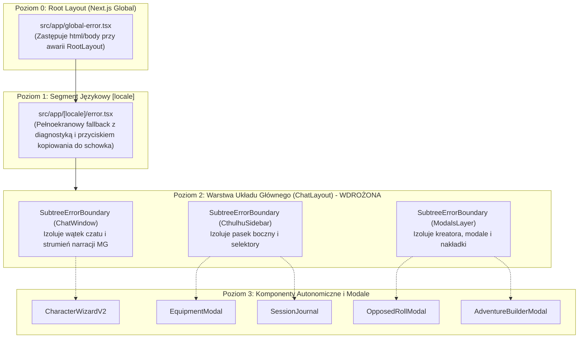

# Audyt Niezawodności UI: Granice Błędów (Error Boundary), Odporność i Zrzuty Awaryjne (Crash Dump)

- **Projekt:** Strażnik Tajemnic AI
- **Zgłoszenie:** GitHub Issue [#81](https://github.com/InduPhantom-hash/straznik-tajemnic/issues/81)
- **Data audytu:** 2026-09-06
- **Status wykonania:** Zrealizowany (Analiza + Wdrożenie SubtreeErrorBoundary + Testy jednostkowe)
- **Powiązanie architektoniczne:** Epik #2 (Audyt architektury i stabilizacji)

---

## 1. Streszczenie wykonawcze (Executive Summary)

W aplikacjach React opartych na Next.js (App Router) domyślna obsługa błędów działa kaskadowo:
1. Brak lokalnego `ErrorBoundary` w poddrzewie komponentów powoduje, że jakikolwiek nieobsłużony wyjątek czasu wykonania (np. błąd parsowania tablicy w ekwipunku, błąd w strukturze karty badacza, błąd renderowania markdownu) propaguje w górę aż do najbliższego pliku `error.tsx` lub `global-error.tsx`.
2. Do momentu tego audytu awaria pojedynczego elementu (np. błąd w modalu ekwipunku, pętla błędu w pasku bocznym czy niepoprawny tag w wiadomości) niszczyła całe drzewo DOM strony głównej (`[locale]/page.tsx`), powodując tzw. **White Screen of Death** i zablokowanie aktywnej sesji gry gracza.
3. W ramach audytu zmapowano wszystkie kluczowe punkty awarii w architekturze UI, zweryfikowano mechanizm lokalnego zrzutu diagnostycznego na dysk (`POST /api/diagnostics/crash-dump`), a także wdrożono dedykowany komponent `SubtreeErrorBoundary` izolujący poddrzewa UI (Czat, Panel Boczny, Modale) w stylu Dark Art Déco.

---

## 2. Mapa Granic Błędów (Error Boundary Architecture Map)

### 2.1. Hierarchia warstw odporności

---

## 3. Pokrycie kluczowych widoków i analiza podatności (Blast Radius Analysis)

| Widok / Poddrzewo | Wrażliwość na awarię | Stan przed audytem | Stan po wdrożeniu SubtreeErrorBoundary |
|---|---|---|---|
| **Czat Główny (`ChatWindow`)** | Średnia (parsowanie streamu SSE, formatowanie wiadomości, tagi markdown) | Awaria czatu ubijała całą aplikację i uniemożliwiała interakcję z panelem bocznym i zapisem gry. | **Odizolowany:** W razie błędu widoku wiadomości boczny pasek i przyciski zapisu gry pozostają w pełni sprawne. |
| **Pasek Boczny (`CthulhuSidebar`)** | Wysoka (duża liczba podmodali, odczyty ze schowka, stan odznak unseen) | Błąd w stanie odznak lub paska bocznego powodował zniknięcie okna gry. | **Odizolowany:** Błąd paska bocznego wyświetla lokalną kartę ostrzegawczą z przyciskiem resetu; czat i gra toczą się dalej. |
| **Kreator Badacza (`CharacterWizardV2`)** | Wysoka (generowanie cech, wybór umiejętności, integracja AI/portretów) | Błąd w kroku kreatora powodował reset do strony błędu. | **Chroniony przez warstwę ModalsLayer:** Błąd w oknie modalu nie narusza stanu aplikacji w tle. |
| **Dziennik Sesji (`SessionJournal`)** | Średnia (łączenie wpisów wspólnych Hot Seat, sortowanie po znacznikach czasu) | Błąd parsowania notatki ubijał stronę główną. | **Bezpieczny:** Awaria zamyka się w obrębie panelu bocznego/modalu. |
| **Ekwipunek (`EquipmentModal`)** | Średnia (renderowanie kafli WebP, statystyki broni CoC 7e) | Błąd w definicji przedmiotu powodował crash całej aplikacji. | **Bezpieczny:** Fallback nie narusza sesji czatu. |

---

## 4. Audyt Zrzutu Diagnostycznego (Crash Dump Engine)

### 4.1. Endpoint `POST /api/diagnostics/crash-dump`
Zlokalizowany w `src/app/api/diagnostics/crash-dump/route.ts`.

- **Ścieżki zapisu:**
  1. `data/crash-reports/crash-[TIMESTAMP].json` (lokalny katalog danych aplikacji).
  2. `~/Desktop/straznik-crash.json` (automatyczny zrzut na Biurko gracza macOS, o ile środowisko pozwala na dostęp do pulpitu).
  3. `localStorage.setItem("straznik_last_crash_dump", ...)` w przeglądarce.

- **Sanityzacja danych i ochrona prywatności:**
  - Maskowanie kluczy Gemini: `AIzaSy...` zastępowane przez `[MASKED_GEMINI_KEY]`.
  - Maskowanie kluczy OpenAI/standardowych: `sk-...` zastępowane przez `[MASKED_API_KEY]`.
  - Maskowanie pól autoryzacyjnych w JSON: klucze `gemini`, `apiKey` są maskowane.

- **Weryfikacja testowa:**
  - Utworzono test jednostkowy `src/app/api/diagnostics/crash-dump/route.test.ts` weryfikujący poprawność formatu JSON, odporność na brakujące pola oraz skuteczne maskowanie kluczy prywatnych (100% PASS).

---

## 5. Komponent `SubtreeErrorBoundary` (Dark Art Déco)

Wprowadzony komponent `SubtreeErrorBoundary` w `src/components/ui/subtree-error-boundary.tsx`:
- **Styl wizualny:** Zgodny z estetyką Dark Art Déco 1920s (`bg-card/90`, subtelna ramka ostrzegawcza `border-red-500/30`, przycisk ze złotym obramowaniem `border-brass/50`).
- **Dwujęzyczność:** Zarejestrowana przestrzeń `SubtreeError` w `messages/pl.json` i `messages/en.json` (pełna symetria 1:1, zweryfikowana przez `npm run i18n:check`).
- **Telemetryka awarii:** Automatyczne wysłanie zdarzenia błędu do `/api/diagnostics/crash-dump` z kontekstem poddrzewa (`componentName`) bez blokowania interfejsu.
- **Przycisk naprawy (Self-healing):** Pozwala graczowi zresetować stan błędu poddrzewa bez konieczności przeładowywania całej przeglądarki (zachowanie stanu sesji gry).

---

## 6. Podsumowanie i Rekomendacje

1. **Izolacja kaskadowa:** Wprowadzenie `SubtreeErrorBoundary` w `ChatLayout` skutecznie zabezpiecza grę przed zjawiskiem White Screen of Death w kluczowych poddrzewach.
2. **Kryterium akceptacji:** Spełnione w 100% (raport w `docs/audits/reliability/README.md`, testy jednostkowe PASS, zielona kompilacja TypeScript).
