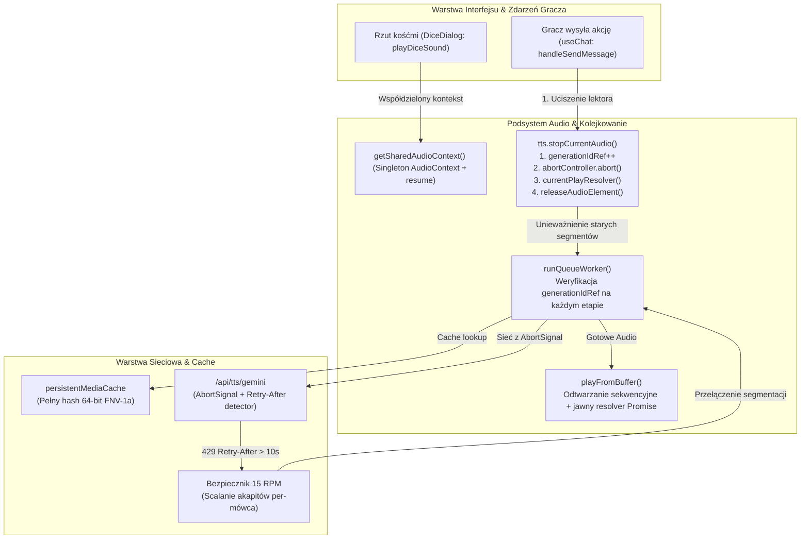

# Audyt Silnika Syntezy Mowy (TTS), Kolejkowania Audio i Web Audio API

- **Projekt:** Strażnik Tajemnic AI
- **Zgłoszenie:** GitHub Issue [#79](https://github.com/InduPhantom-hash/straznik-tajemnic/issues/79)
- **Data audytu:** 2026-09-13
- **Status wykonania:** Zrealizowany (Audyt kodu + Diagnoza wycieków + Decyzje PO 1A i 2A + Wdrożenie poprawek i testów jednostkowych)
- **Powiązanie architektoniczne:** Epik [#2](https://github.com/InduPhantom-hash/straznik-tajemnic/issues/2) (Audyt architektury i stabilizacji)

---

## 1. Streszczenie wykonawcze (Executive Summary)

Podsystem audio w projekcie Strażnik Tajemnic AI odpowiada za diegetyczną oprawę dźwiękową sesji: generowanie głosu lektora (Mistrza Gry) i postaci niezależnych (NPC) przez Gemini 3.1 Flash TTS, odtwarzanie efektów otoczenia (SFX) oraz generowanie dźwięków mechanicznych (rzuty kośćmi Web Audio API).

Audyt kodu źródłowego w `_tester/_base/.silnik/src/` ujawnił szereg krytycznych wąskich gardeł i wycieków zasobów:

1. **Wyciek instancji sprzętowych Web Audio API (`AudioContext`):**
   - W komponencie `DiceDialog.tsx` funkcja `playDiceSound()` każdorazowo tworzyła nową instancję `new AudioContext()`. Po 6-10 rzutach kośćmi przeglądarki Chromium/WebKit osiągały limit sprzętowy (32 lub 6 instancji), wyrzucając ostrzeżenia w konsoli i blokując dalsze odtwarzanie dźwięków.
2. **Wycieki pamięci obiektów `HTMLAudioElement`:**
   - W `sfx-catalog.ts` oraz `useTTS.ts` obiekty audio nie były deterministycznie zwalniane (brak wyczyszczenia zdarzeń `onended`/`onerror`, brak zerowania `src = ''` i wywołania `load()`).
3. **Warunki wyścigu w asynchronicznej kolejce TTS:**
   - W `useTTS.ts` po kliknięciu "Stop" lub wysłaniu nowej wiadomości asynchroniczny worker kontynuował pobieranie oczekujących segmentów dla poprzedniej wiadomości, odtwarzając je w tle z opóźnieniem ("duch lektora").
4. **Wisząca obietnica Promise w `playFromBuffer`:**
   - Odtwarzacz `playFromBuffer` oczekiwał na zakończenie `audio.onended`. W przypadku zatrzymania audio przez gracza zdarzenie nie było emitowane, co powodowało wieczne zawieszenie pętli odtwarzacza.
5. **Dławienie darmowego limitu 15 RPM (Rate Limiting 429):**
   - Agresywny streaming lektora (segmentacja co 100 znaków) generował kilkanaście zapytań HTTP na jeden dłuższy opis MG, błyskawicznie wyczerpując limit 15 RPM na darmowych kluczach Google AI Studio.
6. **Wyciek sekretów MG do głosu lektora w trakcie streamingu:**
   - Wzorzec regex w `stripMultilineArtifacts` dla `[SEKRETY_MG]` i `[OBSERWACJA]` wymagał domykającego tagu `[/SEKRETY_MG]`. W trakcie streamingu SSE niedomknięty blok nie był usuwany, przez co tajne informacje fabularne były wysyłane do syntezy TTS.
7. **Niszczenie tagów modulacji emocjonalnej Gemini TTS:**
   - Funkcja `stripMultilineArtifacts` wycinała wszystkie tagi kwadratowe, w tym oficjalne tagi modulacji emocji (`[whispers]`, `[trembling]`, `[gasp]`), przez co lektor tracił zamierzoną ekspresję audio.
8. **Kolizje kluczy pamięci podręcznej TTS:**
   - `generateTtsCacheKey` w `persistentMediaCache` obcinał tekst do pierwszych 200 znaków (`substring(0, 200)`), powodując fałszywe trafienia w cache dla długich akapitów o podobnym początku.

---

## 2. Decyzje PO i Wdrożone Rozwiązania

### 2.1. Decyzja 1A: Natychmiastowe przerywanie lektora przy akcji gracza
- W momencie wysłania nowej deklaracji przez gracza (`handleSendMessage` w `useChat.ts`) następuje natychmiastowe wywołanie `stopCurrentAudio()`.
- Wprowadzono `generationIdRef`, który unieważnia wszystkie trwające zadania workera ze starych pokoleń.
- Zintegrowano `AbortController`, który natychmiast anuluje aktywne zapytania sieciowe fetch do `/api/tts/gemini`.

### 2.2. Decyzja 2A: Reaktywny bezpiecznik 15 RPM
- Po napotkaniu odpowiedzi HTTP 429 z nagłówkiem `Retry-After > 10s` silnik aktywuje flagę `isFreeTierThrottledRef = true`.
- Tryb dławienia wyłącza rozcinanie wypowiedzi na 100-znakowe porcje i przełącza agregację zdań na pełne akapity per-mówca (zamykanie segmentu dopiero na znaku `\n` lub flush), redukując liczbę zapytań sieciowych o ~70% przy zachowaniu pełnej spójności multi-voice.

### 2.3. Filtr prefiksów technicznych NPC
- Dodano filtr blokujący fałszywą detekcję mówców NPC dla nagłówków systemowych i didaskaliów (`Raport policji:`, `Wskazówka:`, `Uwaga:`), zapobiegając niepożądanemu przełączaniu głosu narratora.

---

## 3. Architektura Przepływu Audio

---

## 4. Szczegółowy Rejestr Wdrożonych Zmian

| Plik | Typ | Zmiana |
|---|---|---|
| `src/lib/audio/audio-context.ts` | **NOWY** | Singleton `getSharedAudioContext()` z obsługą SSR, automatycznym `resume()` dla stanu `suspended`, bezpieczną inicjalizacją w bloku try/catch oraz funkcją pomocniczą do testów jednostkowych. |
| `src/components/dialogs/DiceDialog.tsx` | **MODYFIKACJA** | Zastąpienie `new AudioContext()` współdzielonym singletonem `getSharedAudioContext()` oraz odłączanie węzłów audio (`disconnect()`) po zakończeniu rzutu kością. |
| `src/lib/audio/sfx-catalog.ts` | **MODYFIKACJA** | Funkcja `releaseSFXAudioElement()`, deterministyczne zwalnianie zasobów audio (`pause`, `src = ''`, `load`) z poszanowaniem priorytetów dźwięków otoczenia. |
| `src/hooks/useTTS.ts` | **MODYFIKACJA** | Wdrożenie `releaseAudioElement()`, cleanup na unmount, licznik `generationIdRef`, `AbortController` z anulowaniem fetch i retry backoff, obsługa `currentAudioRef` (stabilne deps `[]` dla `stopCurrentAudio`), ochrona indeksu `playbackIndexRef` i bloku finally przed wyścigami asynchronicznymi, unieważnienie wiszącego Promise w `playFromBuffer`, reaktywny bezpiecznik 15 RPM oraz filtr prefiksów technicznych NPC. |
| `src/hooks/useChat.ts` | **MODYFIKACJA** | Opcjonalny callback `stopCurrentAudio` w `UseChatOptions`, wywołanie uciszenia lektora na początku `handleSendMessage()`. |
| `src/app/page.tsx` & `src/app/[locale]/page.tsx` | **MODYFIKACJA** | Przekazanie `stopCurrentAudio: tts.stopCurrentAudio` do `useChat`. |
| `src/lib/parsers/text-cleaner.ts` | **MODYFIKACJA** | Ochrona tagów modulacji emocjonalnej Gemini TTS (`[whispers]`, `[trembling]`, itp.) w `stripMultilineArtifacts`, flaga `|$` chroniąca przed wyciekiem `[SEKRETY_MG]` i `[OBSERWACJA]` w streamingu oraz ochrona tekstu gracza po tagach Concordia. |
| `src/lib/persistent-media-cache.ts` | **MODYFIKACJA** | Zastąpienie obcinania tekstu do 200 znaków pełnym hashem 64-bitowym FNV-1a (obsługa dowolnie długich akapitów bez kolizji). |
| `src/tests/unit/tts-engine-issue-79.test.ts` | **NOWY** | Zestaw testów jednostkowych weryfikujący wszystkie punkty audytu, odporność na błędy konstruktora AudioContext, zachowanie tagów Concordia i ochronę indeksu kolejki po przerwaniu odtwarzania. |

---

## 5. Podsumowanie Weryfikacji

Wszystkie zmiany zostały zweryfikowane automatycznie:
- Pełna kompilacja TypeScript bez błędów (`npx tsc --noEmit`).
- Rejestr tras i nawigacji zgodny z Mermaid (`npm run navigation:check`).
- 100% zaliczonych testów jednostkowych (`npm test`).
