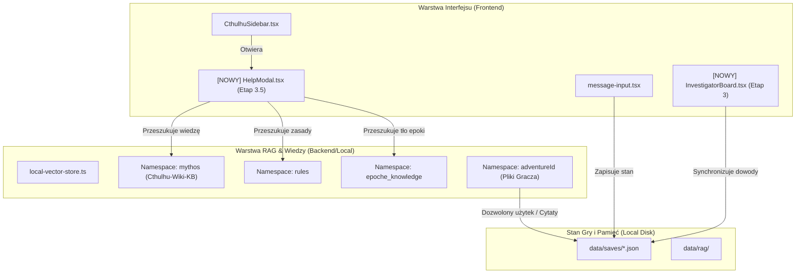

# 🎯 State & Feature Tracker: Strażnik Tajemnic AI

> **Aktualny status projektu:** Etap 1 Ukończony | Etap 3.5 (HelpModal & Encyklopedia) Ukończony | Etap 2 (Pipeline przygody) & Etap 3 (Immersja) w trakcie | Rekomendowany najbliższy krok: **Etap 3 (Automatyczna Tablica Badacza)**

---

## 🧭 Dashboard Statusu Projektu (Linear-Style View)

| Obszar / Kamień Milowy | Stan | Progres | Kluczowy Plik / Moduł | Zależności |
| :--- | :--- | :--- | :--- | :--- |
| **Stan Bazowy (Core System)** | 🟢 DONE | 100% | `src/app/api/chat/`, `src/lib/dice-utils.ts` | Baza projektu |
| **Model Gemini 3.6 Flash Baseline** | 🟢 DONE | 100% | `src/lib/model-registry.ts`, `src/lib/ai-presets/` | Domyślna obsługa aplikacji |
| **Etap 1: Domknięcie Sesji** | 🟢 DONE | 100% | `src/components/sidebar/CthulhuSidebar.tsx` | State machine sesji |
| **Etap 2: Pipeline Przygody & RAG** | 🟡 IN PROGRESS | 40% | `src/lib/vector-db/local-vector-store.ts` | SQLite / Local RAG |
| **Etap 3: Immersja & Tablica Badacza** | 🟢 DONE | 100% | `src/app/api/chat/_helpers/build-immersion-context.ts` | API danych świata + Save |
| **Etap 3.5: Encyklopedia & Pomoc (RAG)** | 🟢 DONE | 100% | `src/components/help-modal/`, `data/epochs/pl-1990s-2000s/` | Local RAG (`mythos`, `epoch_pl_90s`) |
| **Etap 0.5: Onboarding & Quick Setup Flow** | 🔵 TODO | 0% | `src/components/onboarding/` | i18n / Gemini Key / Presety |
| **Etap 0: Bezpieczny System Aktualizacji** | 🔵 TODO | 0% | `desktop/launcher.sh`, `desktop/build-app.sh` | Electron / Mac Launcher |
| **Etap 4: Adventure Creator & Graf** | 🔵 TODO | 0% | `src/lib/adventures-data.ts` | Graf stanu scen |
| **Etap 5: Wsparcie Multilang PL/EN** | 🔵 TODO | 0% | `src/lib/i18n/` | Słowniki UI & Master Prompt |
| **Etap 6: Lokalne Dyktowanie (Whisper.cpp)** | 🔵 TODO | 0% | `whisper.cpp`, `src/components/chat/message-input.tsx` | Runtime natywny STT |

---

## 🟢 1. Ukończone Funkcje (DONE)

- [x] **Domyślny model Gemini 3.6 Flash (Low):** Ustawienie modelu `gemini-3.6-flash` jako domyślnego dla całej aplikacji oraz zaktualizowanie szacunków kosztów w rejestrze i presetach (`src/lib/model-registry.ts`).
- [x] **Master Prompt MG (CoC 7e RAW):** Styl Lovecrafta, wsparcie dla trybów Noir/Pulp/Klasyczny (`public/default-gm-prompt.md`).
- [x] **Deterministyczny Silnik Rzutów:** k100, progi trudności (Zwykły/Trudny/Ekstremalny/Krytyk/Fumble), obsługa Push Roll i Szczęścia (`src/lib/dice-utils.ts`).
- [x] **Lokalny Magazyn RAG (Float32Array):** Przechowywanie wektorów i chunkowanie PDF bez chmurowego Pinecone (`src/lib/vector-db/local-vector-store.ts`).
- [x] **Protokół Zamknięcia Sesji `[KONIEC_SESJI]`:** Bezpieczny autozapis, wygaszanie interfejsu i podsumowanie sesji (`src/app/api/chat/_helpers/run-chat-pipeline.ts`).
- [x] **Immersja Danych Świata:** Włączanie kontekstu astronomii (pory dnia/fazy księżyca), cen z epoki oraz nagłówków prasowych z oznaczeniem źródła i daty (`src/app/api/chat/_helpers/build-immersion-context.ts`).
- [x] **Sensoryczny Model Szaleństwa:** Generowanie traum i obłędu bez mechanicznego języka w narracji.
- [x] **Wielowarstwowy Profil NPC:** Generowanie kontekstu relacji i ukrytych celów dla postaci niezależnych.
- [x] **System Przeczytania Dokumentów:** Generowanie treści listów i manuskryptów z zapisem w karcie postaci.

---

## 🟡 2. W Trakcie / Częściowo Zrealizowane (IN PROGRESS)

- [/] **Lokalny Pipeline Przygody (Etap 2):**
  - [x] Izolacja przygód w nazwach namespace.
  - [x] Naprawa stabilności i wydajności uploadu PDF (polling stanu ACTIVE w Gemini File API, throttling embeddingów).
  - [x] Rozszerzona ekstrakcja z PDF do JSON (NPC, lokacje, mapy, przedmioty fabularne) przy użyciu modelu Gemini 3.6 Flash.
  - [x] Zapis metadanych i ustrukturyzowanej przygody bezpośrednio w `data/adventures/{adventureId}.json`.
  - [x] Stworzenie predefiniowanych scenariuszy nieliniowych (`data/adventures/predefined/`):
    - `Cień nad Prabutami: Widzenie Ojca Klimuszki` (`cien-nad-prabutami.json`).
    - `Tajemnica Pędnika: Genialny Wynalazca z Kowar` (`tajemnica-pendnika-lagiewki.json`).
    - `Tajemnica Dzieci z Traszyna: Klucz i Odwrócony Krzyż` (`tajemnica-dzieci-z-traszyna.json`).
- [x] **Tablica Badacza / Dowody (Etap 3):**
  - [x] Integracja danych zewnętrznych z fallbackiem.
  - [x] Przebudowa Dziennika na automatycznie aktualizowaną Tablicę Badacza (dowody, poszlaki, hipotezy, powiązania).
  - [x] Zapis grafu dowodów w save'ach (w tym dla trybu Hot Seat).

---

## 🔵 3. Zaplanowane do Realizacji (BACKLOG & ROADMAP)

### 📌 Etap 3.5 - Wewnętrzna Encyklopedia, Pomoc & Onboarding (PRIORYTET BIEŻĄCY)
> **Cel:** Zbudowanie bezpiecznego prawnie, pełnoekranowego modalu pomocy i wiedzy wspieranego lokalnym RAG-iem.

- [ ] **Komponent UI (Full-screen Modal / Drawer):** Wdrożenie modalu otwieranego z menu/ustawień z globalną wyszukiwarką i asystentem AI.
- [ ] **5 Zakładek Pomocy & Wiedzy:**
  1. 🎮 **Interfejs Gry:** Wyjaśnienie przycisków, pasków SAN/HP/MP/Szczęście, rzutów kośćmi i ekwipunku.
  2. 🎲 **Jak grać?:** Poradnik pętli gry z AI i tworzenia deklaracji w cosmic horror RPG.
  3. 📚 **Bestiariusz & Lore:** Encyklopedia mitów z wyszukiwarką na bazie zintegrowanej wiedzy `Cthulhu-Wiki-KB`.
  4. 📜 **Zasady & Mechanika:** Skrót zasad CoC 7e, obłędu, poczytalności, testów przedłużonych i walki.
  5. ℹ️ **Informacje & Prawa Autorskie:** Oświadczenie prawne o Public Domain Lovecrafta oraz Fan Policy Chaosium.
- [x] **Syntetyzacja Bazy Epok (Polska 1990–2000):** Opracowanie autorskich syntez tła społecznego, prawa, obyczajów, wierzeń i technologii z materiałów researchu (`data/epochs/pl-1990s-2000s/`).
- [x] **Encyklopedia Gracza & Komponent UI:** Wdrożenie zakładki Wiki w modalu pomocy (`HelpModal.tsx`, `EpochWikiTab.tsx`).
- [ ] **Postaci Historyczne:** Wierne dane biograficzne z opcjonalnymi warstwami nadprzyrodzonymi dla przygód.
- [ ] **Izolacja Prawna (Two-Tier RAG):** Wbudowany RAG (Public Domain + syntezy) vs Prywatny RAG Gracza (wgrane pliki PDF z prawem do cytowania stron w ramach dozwolonego użytku).

### 📌 Etap 0.5 - Wprowadzenie Gracza (Onboarding & Quick Setup Flow)
> **Cel:** Uporządkowany proces pierwszego uruchomienia gry: Wybór języka -> Klucz Gemini -> Ekran powitalny MG -> Quick Setup / Custom.

- [ ] **Wybór Języka (PL / EN):** Ekran inicjalny wyboru wersji językowej (zależny od Etapu 5 i18n).
- [ ] **Weryfikacja / Wprowadzenie Klucza API Gemini:** Monit o klucz API pojawiający się przy braku zapisanej konfiguracji z natychmiastową walidacją.
- [ ] **Wirtualny Mistrz Gry – Okno Powitalne:** Narracyjne wprowadzenie w klimacie Lovecrafta oraz wybór trybu startu:
  - ⚡ **Quick Setup:** Wybór z listy predefiniowanych przygód z gotowymi postaciami (męskie / żeńskie).
  - 🛠️ **Manual Setup:** Przejście do głównego menu ze szczegółowym tworzeniem postaci i scenariusza.

### 📌 Etap 0 - Bezpieczny System Aktualizacji
- [ ] Integracja wydań z GitHub Releases (manifest, checksum, auto-update).
- [ ] Atomowa podmiana kodu i skrypt tworzenia backupów przed aktualizacją.
- [ ] Rozdzielenie katalogu kodu od katalogu danych użytkownika (`data/saves/`, `data/rag/`).

### 📌 Etap 4 - Adventure Creator & Graf Stanu
- [ ] Baza grafowa stanu przygody (SQLite Graph / JSON State).
- [ ] Generator przygód (Adventure Creator Engine) na podstawie 3-4 założeń gracza.
- [ ] System wyliczania nagłówków relacji wstrzykiwanych do każdego promptu MG.

### 📌 Etap 5 - Wielojęzyczność (PL/EN)
- [ ] Warstwa i18n dla interfejsu użytkownika.
- [ ] Angielski Master Prompt MG oraz weryfikacja angielskich źródeł w RAG.

### 📌 Etap 6 - Lokalne Dyktowanie Głosowe (Whisper.cpp)
- [ ] Integracja natywnego runtime'u `whisper.cpp` (model `base` Q5/Q8).
- [ ] Dyktowanie wiadomości offline bez wysyłania nagrań audio do chmury.

---

## 🔗 4. Graf Zależności i Wpływu Modułów (Linear Graph)

---

## 🗃️ 5. Tracker Materiałów i Bazy Wiedzy (Knowledge Assets)

- **`AIOS-Vault/Projekty/Hobby/RPG/Cthulhu-Wiki-KB/`**:
  - `lovecraft-fandom/`: Tysiące wpisów o mitach, potworach i lokacjach (EN).
  - `_pl/`: Polskie jsony wpisów encyklopedycznych (PL).
  - `manifest.json` (~10 MB): Indeks i graf powiązań wiedzy (Do wykorzystania w RAG).
- **`straznik-tajemnic/temp_lovecraft/`**:
  - 42 opracowania naukowe (ResearchGate, Semantic Scholar, filologia Lovecrafta).

---

## 📝 Instrukcja Utrzymania Trackera (`state.md`)

Przed rozpoczęciem nowego zadania lub po ukończeniu etapu:
1. Zaktualizuj macierz w sekcji **Dashboard Statusu Projektu**.
2. Przenieś ukończone zadania z sekcji **BACKLOG** do **DONE**.
3. Upewnij się, że modyfikacje pliku są zgodne z mapą powiązań w [`docs/MAPA-POWIAZAN.md`](file:///Volumes/Karta/Developer/straznik-tajemnic/docs/MAPA-POWIAZAN.md).
