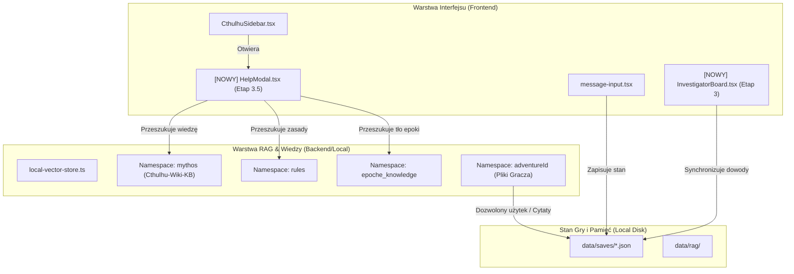

# 🎯 State & Feature Tracker: Strażnik Tajemnic AI

> **Aktualny status projektu:** Etap 1 Ukończony | Etap 3.5 (HelpModal & Encyklopedia) Ukończony | Etap 2 (Pipeline przygody) & Etap 3 (Immersja) w trakcie | Rekomendowany najbliższy krok: **Etap 3 (Automatyczna Tablica Badacza)**

---

## 🧭 Dashboard Statusu Projektu (Linear-Style View)

| Obszar / Kamień Milowy | Stan | Progres | Kluczowy Plik / Moduł | Zależności |
| :--- | :--- | :--- | :--- | :--- |
| **Stan Bazowy (Core System)** | 🟢 DONE | 100% | `src/app/api/chat/`, `src/lib/dice-utils.ts` | Baza projektu |
| **Modele AI i presety** | 🟢 DONE | 100% | `src/lib/model-registry.ts`, `src/lib/ai-presets/` | Domyślny preset HIGH: Gemini 2.5 Flash; fallback czatu: Gemini 3.6 Flash |
| **Etap 1: Domknięcie Sesji** | 🟢 DONE | 100% | `src/components/sidebar/CthulhuSidebar.tsx` | State machine sesji |
| **Etap 2: Pipeline Przygody & RAG** | 🟡 IN PROGRESS | 40% | `src/lib/vector-db/local-vector-store.ts` | SQLite / Local RAG |
| **Etap 3: Immersja & Tablica Badacza** | 🟢 DONE | 100% | `src/app/api/chat/_helpers/build-immersion-context.ts` | API danych świata + Save |
| **Etap 3.5: Encyklopedia & Pomoc (RAG)** | 🟢 DONE | 100% | `src/components/help-modal/`, `data/epochs/pl-1990s-2000s/` | Local RAG (`mythos`, `epoch_pl_90s`) |
| **Etap 0.5: Onboarding & Quick Setup Flow** | 🟢 DONE | 100% | `src/components/onboarding/` | Klucz Gemini / PDF / Quick Setup |
| **Etap 0: Bezpieczny System Aktualizacji** | 🔵 TODO | 0% | `desktop/launcher.sh`, `desktop/build-app.sh` | Electron / Mac Launcher |
| **Etap 4: Adventure Creator & Graf** | 🔵 TODO | 0% | `src/lib/adventures-data.ts` | Graf stanu scen |
| **Etap 5: Wsparcie Multilang PL/EN** | 🔵 TODO | 0% | `src/lib/i18n/` | Słowniki UI & Master Prompt |
| **Etap 6: Lokalne Dyktowanie (Whisper.cpp)** | 🔵 TODO | 0% | `whisper.cpp`, `src/components/chat/message-input.tsx` | Runtime natywny STT |

---

## 🟢 1. Ukończone Funkcje (DONE)

- [x] **Modele i presety Gemini:** Preset LOW i MID używa `gemini-3.6-flash`, HIGH `gemini-2.5-flash`, a ULTRA `gemini-3.1-pro-preview`. Fallback czatu to `gemini-3.6-flash`.
- [x] **Master Prompt MG (CoC 7e RAW):** Styl Lovecrafta, wsparcie dla trybów Noir/Pulp/Klasyczny (`public/default-gm-prompt.md`).
- [x] **Deterministyczny Silnik Rzutów:** k100, progi trudności (Zwykły/Trudny/Ekstremalny/Krytyk/Fumble), obsługa Push Roll i Szczęścia (`src/lib/dice-utils.ts`).
- [x] **Lokalny Magazyn RAG (Float32Array):** Przechowywanie wektorów i chunkowanie PDF bez chmurowego Pinecone (`src/lib/vector-db/local-vector-store.ts`).
- [x] **Protokół Zamknięcia Sesji `[KONIEC_SESJI]`:** Bezpieczny autozapis, wygaszanie interfejsu i podsumowanie sesji (`src/app/api/chat/_helpers/run-chat-pipeline.ts`).
- [x] **Immersja Danych Świata:** Włączanie kontekstu astronomii (pory dnia/fazy księżyca), cen z epoki oraz nagłówków prasowych z oznaczeniem źródła i daty (`src/app/api/chat/_helpers/build-immersion-context.ts`).
- [x] **Sensoryczny Model Szaleństwa:** Generowanie traum i obłędu bez mechanicznego języka w narracji.
- [x] **Wielowarstwowy Profil NPC:** Generowanie kontekstu relacji i ukrytych celów dla postaci niezależnych.
- [x] **Paczki Badaczy dla Szybkiej Przygody (Strefa 11):** Dodano 12 nowych badaczy i spięto mapowanie logiki w modalu (`strefa-11-characters.ts`, `quick-setup-modal.tsx`).
- [x] **Generatory Fabularne (Etap 3.5 - Piggybacking):** Ręczne zdarzenia losowe (pogoda, przechodnie, wydarzenia kosmiczne/miejskie) przekazywane jako ukryta instrukcja reżyserska `[INSTRUKCJA REŻYSERSKA]` w strumieniu bez psujących cykl wiadomości wyścigów stanów (`RandomEventGenerator`, `useChat.ts`, `build-context.ts`).
- [x] **Ujednolicenie Dziennika i Usunięcie Długu Legacy Journal (Zadanie 1):** Usunięto 4 pliki legacy (`app/journal/page.tsx`, `app/api/journal/route.ts`, `components/ui/journal.tsx`, `lib/journal/types.ts`), wyczyszczono `useFullReset.ts` i ujednolicono architekturę na `character.journal` / `sharedJournal` (`session-journal.tsx`).
- [x] **Wizualizacje i Nowy Dziennik Śledczy (Odkrycia & Tablica Badacza):**
  - Wyraziste, czytelne liczniki kategorii o wysokim kontraście (`discoveries-view.tsx`).
  - Automatyczne pobieranie wizerunków NPC, lokacji i przedmiotów z referencji gry oraz `EQUIPMENT_CATALOG`.
  - Diegetyczne fallbacki stylizowane na akta policyjne (*„Akta Osobowe :: Fotografia w archiwizacji”*, *„Plan Terenu :: Szkic sytuacyjny”*, `EquipmentImagePlaceholder`).
  - Ścisłe egzekwowanie Visual DNA dla postaci w promptach generowania obrazów (`image-instructions.ts`).
- [x] **Inteligentna Dedukcja MG i Umiejętności Domenowe (CoC 7e RAW):**
  - Pełny modal Dedukcji Śledczej z wyborem konkretnej poszlaki i metody: umiejętność zawodowa (np. *Medycyna*, *Okultyzm*, *Spostrzegawczość*, *Historia*) LUB koło ratunkowe *Rzut na Pomysł (INT)* (`corkboard-investigation-board.tsx`).
  - Precyzyjne kalkulacje progów CoC 7e (Zwykły, Trudny ½, Ekstremalny ⅕, Krytyk 01, Fumble 96-100/100).
  - Wnioski narracyjne generowane przez AI i bezpośrednio zapisywane w badanym dowodzie (`investigatorInsight`) bez generowania zbędnych pustych kafelków.
- [x] **Aktualizacja Instrukcji Systemowych MG (Worldbuilding & Kontrast Grozy):**
  - Zaktualizowano `public/default-gm-prompt.md` oraz `.silnik/public/...` (Część I, II, IV, V, VIII, XVIII) o reguły: Kontrast Grozy (80% tła materialnego, 1 punkt anomalii), Materialne User Story lokacji (światło, ogrzewanie, łączność), Echo Akcji u NPC, Actionable Clues/Lore w handoutach i księgach oraz Anti Info-Dumping.
  - Zaktualizowano `lovecraft-style-guide.ts` (Filary 1, 3, 9: zakaz inflacji anomalii geometrycznych w zwykłych budynkach) oraz `gm-protocol.ts` (`[MYŚLI_MG]` z polem `ECHO_AKCJI`).
  - Wdrożono moduł walidatora epokowego `location-era-validator.ts` z testami jednostkowymi i integracją z generatorem obrazów (`imagen/route.ts`).
  - Dodano zestaw testów `prompt-section-parser.test.ts` (100% PASS, 205/205 testów zdanych w projekcie).

---

## 🟡 2. W Trakcie / Częściowo Zrealizowane (IN PROGRESS)

- [/] **Obrazy scen, pełny kadr i spójność epok:** Audyt ukończony, plan wdrożenia czeka na `/dev-2-plan`. Aktywny endpoint używa `gemini-2.5-flash-image`; wymagane są reguły 1-3 obrazów na scenę oraz rok obrazu wynikający z aktualnego czasu gry.
- [/] **Lokalny Pipeline Przygody (Etap 2):**
  - [x] Izolacja przygód w nazwach namespace.
  - [x] Naprawa stabilności i wydajności uploadu PDF (polling stanu ACTIVE w Gemini File API, throttling embeddingów).
  - [x] Rozszerzona ekstrakcja z PDF do JSON (NPC, lokacje, mapy, przedmioty fabularne) przy użyciu modelu Gemini 3.6 Flash.
  - [x] Zapis metadanych i ustrukturyzowanej przygody bezpośrednio w `data/adventures/{adventureId}.json`.
  - [x] Stworzenie predefiniowanych scenariuszy nieliniowych (`data/adventures/predefined/`):
    - `Cień nad Prabutami: Widzenie Ojca Klimuszki` (`cien-nad-prabutami.json`).
    - `Tajemnica Pędnika: Genialny Wynalazca z Kowar` (`tajemnica-pendnika-lagiewki.json`).
    - `Tajemnica Dzieci z Traszyna: Klucz i Odwrócony Krzyż` (`tajemnica-dzieci-z-traszyna.json`).
- [x] **Tablica Badacza / Dowody (Etap 3):**
  - [x] Integracja danych zewnętrznych z fallbackiem.
  - [x] Przebudowa Dziennika na automatycznie aktualizowaną Tablicę Badacza (dowody, poszlaki, hipotezy, powiązania).
  - [x] Zapis grafu dowodów w save'ach (w tym dla trybu Hot Seat).

---

## 🔵 3. Zaplanowane do Realizacji (BACKLOG & ROADMAP)

### 📌 Etap 3.5 - Wewnętrzna Encyklopedia, Pomoc & Onboarding (PRIORYTET BIEŻĄCY)
> **Cel:** Zbudowanie bezpiecznego prawnie, pełnoekranowego modalu pomocy i wiedzy wspieranego lokalnym RAG-iem.

- [ ] **Komponent UI (Full-screen Modal / Drawer):** Wdrożenie modalu otwieranego z menu/ustawień z globalną wyszukiwarką i asystentem AI.
- [ ] **5 Zakładek Pomocy & Wiedzy:**
  1. 🎮 **Interfejs Gry:** Wyjaśnienie przycisków, pasków SAN/HP/MP/Szczęście, rzutów kośćmi i ekwipunku.
  2. 🎲 **Jak grać?:** Poradnik pętli gry z AI i tworzenia deklaracji w cosmic horror RPG.
  3. 📚 **Bestiariusz & Lore:** Encyklopedia mitów z wyszukiwarką na bazie zintegrowanej wiedzy `Cthulhu-Wiki-KB`.
  4. 📜 **Zasady & Mechanika:** Skrót zasad CoC 7e, obłędu, poczytalności, testów przedłużonych i walki.
  5. ℹ️ **Informacje & Prawa Autorskie:** Oświadczenie prawne o Public Domain Lovecrafta oraz Fan Policy Chaosium.
- [x] **Syntetyzacja Bazy Epok (Polska 1990–2000):** Opracowanie autorskich syntez tła społecznego, prawa, obyczajów, wierzeń i technologii z materiałów researchu (`data/epochs/pl-1990s-2000s/`).
- [x] **Encyklopedia Gracza & Komponent UI:** Wdrożenie zakładki Wiki w modalu pomocy (`HelpModal.tsx`, `EpochWikiTab.tsx`).
- [ ] **Postaci Historyczne:** Wierne dane biograficzne z opcjonalnymi warstwami nadprzyrodzonymi dla przygód.
- [ ] **Izolacja Prawna (Two-Tier RAG):** Wbudowany RAG (Public Domain + syntezy) vs Prywatny RAG Gracza (wgrane pliki PDF z prawem do cytowania stron w ramach dozwolonego użytku).

### 📌 Etap 3.6 - Stabilizacja Immersji (UI i Zaległości z Sekcji 3 i 4)
- [x] **Nowe Widoki Diegetyczne:** Stworzenie dedykowanych układów CSS w `DiegeticDocumentViewer` dla notatnika (`journal_page`) i biletu (`ticket`).
- [x] **Przebudowa Predefiniowanych Badaczy (Sekcja 3):** Zrealizowano dla trybu Szybkiej Przygody (12 dedykowanych postaci dla Strefy 11).
- [ ] **Dedykowane Portrety Graczy Strefy 11:** Wygenerowanie zbioru portretów pasujących do lat 90./TV Strefa 11 (`/public/portraits/predefined/strefa11/`).
- [ ] **Awatary w Czecie (Sekcja 4):** Integracja portretów NPC w wypowiedziach AI (`render-narrative-with-images.tsx`).
- [x] **Synchronizacja Parsera Dokumentów:** Przeniesienie logiki przypisywania `documentType` z silnika testowego (`_tester`) do głównej aplikacji (`src/lib/acquired-equipment.ts`).

### 📌 Etap 0.5 - Wprowadzenie Gracza (Onboarding & Ekran Startowy)
> **Cel:** Uporządkowany proces pierwszego uruchomienia gry przy Zimnym Starcie.

- [ ] **Krok 0: Hard-loading Screen (Sekcja 4):** "Twardy" czarny ekran ładowania blokujący grę na czas inicjalizacji bufora TTS.
- [ ] **Krok 1: Weryfikacja / Klucz API Gemini & Zasady:** Walidacja klucza API oraz stan wgranego podręcznika.
- [x] **Krok 2: Czysty Ekran Startowy (Sekcja 6):** Wyczyszczenie obcych linków z `page.tsx` oraz finalny layout powitalny z elastycznym wypełnieniem ekranu (85vw) i własnym systemem scrollbara.
- [ ] **Krok 3: Wybór Trybu Startu:**
  - ⚡ **3.1 Quick Setup (Szybka Przygoda):** Wybór liczby graczy (Solo / Duet / Hot Seat) + zwięzłe opisy przygotowanych przygód z przypisanymi postaciami.
  - 🛠️ **3.2 Manual Setup (Manualny Setup):** Wejście do obecnego menu głównego (Tryb Gry, Wybierz Przygodę, Sesja Zero, Stwórz postać). *Uwaga Architektoniczna: W module "Stwórz postać", dodaj endpoint LLM (ok. 300 słów), który po uzupełnieniu atrybutów takich jak miejsce urodzenia, trauma czy przedmiot, automatycznie syntetyzuje je w mroczną, spójną historię (backstory).*

### 📌 Etap 5 - Wielojęzyczność (PL/EN) i Architektura (Sekcja 7)
- [ ] Przełącznik flagi PL/EN na ekranie startowym (`page.tsx`) bez globalnego `next-i18next`.
- [ ] Wymuszenie w kontekście LLM działania w wybranym języku (`run-chat-pipeline.ts`).
- [ ] Angielski Master Prompt MG oraz weryfikacja angielskich źródeł w RAG.

### 📌 Etap 6 - Dźwięk: TTS Słuchowisko i Lokalne Dyktowanie (Sekcja 5)
- [ ] **Dynamiczny TTS Słuchowisko (Sekcja 5):** Zróżnicowanie modulacji TTS (emocje, płeć) na podstawie tagów z promptu AI (`route.ts`).
- [ ] **Telemetryczny Cost Control (Sekcja 5):** Aktualizacja stawek użycia API w logach tokenów (`ai-cost-tracker.ts`).
- [ ] **Lokalne Dyktowanie Głosowe:** Integracja natywnego runtime'u `whisper.cpp` (model `base` Q5/Q8) dla dyktowania offline bez chmury.

### 📌 Etap 4 - Adventure Creator & Graf Stanu
- [ ] Baza grafowa stanu przygody (SQLite Graph / JSON State).
- [ ] Generator przygód (Adventure Creator Engine) na podstawie 3-4 założeń gracza.
- [ ] System wyliczania nagłówków relacji wstrzykiwanych do każdego promptu MG.

### 📌 Etap 0 - Bezpieczny System Aktualizacji
- [ ] Integracja wydań z GitHub Releases (manifest, checksum, auto-update).
- [ ] Atomowa podmiana kodu i skrypt tworzenia backupów przed aktualizacją.
- [ ] Rozdzielenie katalogu kodu od katalogu danych użytkownika (`data/saves/`, `data/rag/`).

---

## 🔗 4. Graf Zależności i Wpływu Modułów (Linear Graph)

```mermaid
graph TD
    subgraph UI_Layer ["Warstwa Interfejsu (Frontend)"]
        SIDEBAR["CthulhuSidebar.tsx"]
        MSG_INPUT["message-input.tsx"]
        HELP_MODAL["[NOWY] HelpModal.tsx (Etap 3.5)"]
        BOARD["[NOWY] InvestigatorBoard.tsx (Etap 3)"]
    end

    subgraph RAG_Layer ["Warstwa RAG & Wiedzy (Backend/Local)"]
        VECTOR_STORE["local-vector-store.ts"]
        MYTHOS_NS["Namespace: mythos (Cthulhu-Wiki-KB)"]
        RULES_NS["Namespace: rules"]
        EPOCH_NS["Namespace: epoche_knowledge"]
        USER_PDF_NS["Namespace: adventureId (Pliki Gracza)"]
    end

    subgraph Game_State ["Stan Gry i Pamięć (Local Disk)"]
        SAVES["data/saves/*.json"]
        PAST_LOGS["data/rag/"]
    end

    HELP_MODAL -->|Przeszukuje wiedzę| MYTHOS_NS
    HELP_MODAL -->|Przeszukuje zasady| RULES_NS
    HELP_MODAL -->|Przeszukuje tło epoki| EPOCH_NS
    USER_PDF_NS -->|Dozwolony użytek / Cytaty| SAVES
    MSG_INPUT -->|Zapisuje stan| SAVES
    BOARD -->|Synchronizuje dowody| SAVES
    SIDEBAR -->|Otwiera| HELP_MODAL
```

---

## 🗃️ 5. Tracker Materiałów i Bazy Wiedzy (Knowledge Assets)

- **`AIOS-Vault/Projekty/Hobby/RPG/Cthulhu-Wiki-KB/`**:
  - `lovecraft-fandom/`: Tysiące wpisów o mitach, potworach i lokacjach (EN).
  - `_pl/`: Polskie jsony wpisów encyklopedycznych (PL).
  - `manifest.json` (~10 MB): Indeks i graf powiązań wiedzy (Do wykorzystania w RAG).
- **`straznik-tajemnic/temp_lovecraft/`**:
  - 42 opracowania naukowe (ResearchGate, Semantic Scholar, filologia Lovecrafta).

---

## 📝 Instrukcja Utrzymania Trackera (`state.md`)

Przed rozpoczęciem nowego zadania lub po ukończeniu etapu:
1. Zaktualizuj macierz w sekcji **Dashboard Statusu Projektu**.
2. Przenieś ukończone zadania z sekcji **BACKLOG** do **DONE**.
3. Upewnij się, że modyfikacje pliku są zgodne z mapą powiązań w [`docs/MAPA-POWIAZAN.md`](file:///Volumes/Karta/Developer/straznik-tajemnic/docs/MAPA-POWIAZAN.md).
